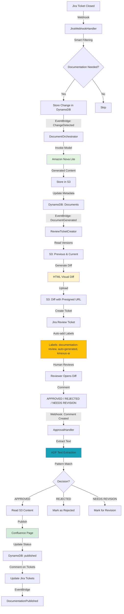

# Human Approval Workflow Documentation

## Overview

The Kinexus AI approval workflow provides human oversight for AI-generated documentation through Jira ticket-based review with visual diffs.

---

## Complete Workflow

### Phase 1: Trigger (Jira Ticket Closed)

**Critical: Ticket Status Transition Requirements**

The workflow **only triggers** when tickets transition from an **active work state** to a completion state.

**Valid Transitions (Will Trigger):**
```
✅ In Progress → Done
✅ In Review → Done
✅ Testing → Done
✅ QA → Closed
```

**Invalid Transitions (Will NOT Trigger):**
```
❌ To Do → Done         (ticket wasn't actively worked on)
❌ Backlog → Closed     (just cleanup, no real work)
❌ Open → Resolved      (not in active development)
```

**Exception: `needs-docs` Label**
- Tickets with the `needs-docs` label **always trigger** regardless of status transitions
- Use this for edge cases where you need to force documentation generation

**How to Add Labels in Jira:**
1. Open the ticket (e.g., https://yourcompany.atlassian.net/browse/TOAST-42)
2. Find the **Labels** field (usually in the Details section on the right)
3. Click the Labels field and type `needs-docs`
4. Press Enter to add the label

**Workflow Steps:**

1. Developer transitions a Jira ticket from active state to done (e.g., `In Progress → Done` for `TOAST-42: Add OAuth2 authentication`)
2. Jira webhook fires → `jira_webhook_handler` Lambda
3. **Smart filtering** determines if documentation is needed:
   - ✅ Check: Is ticket transitioning **TO** Done/Closed/Resolved?
   - ✅ Check: Is ticket transitioning **FROM** In Progress/In Review/Testing/QA?
   - ✅ Check: Does ticket have `needs-docs` label? (bypasses previous check)
   - ✅ Check: Is ticket type Story/Feature/Epic/Task?
   - ❌ Skip: If ticket is too old (>30 days) or has `no-docs` label
4. Change record created in DynamoDB (`kinexus-changes` table)
5. EventBridge event sent (`kinexus.jira` / `ChangeDetected`)

### Phase 2: Documentation Generation

6. EventBridge triggers `document_orchestrator` Lambda
7. Orchestrator analyzes impact using Amazon Nova Lite (Bedrock)
8. Nova Lite generates documentation content
9. Content stored in S3 (`s3://kinexus-documents-{account}/documents/`)
10. Metadata stored in DynamoDB (`kinexus-documents` table)
11. **EventBridge event sent** (`kinexus.orchestrator` / `DocumentGenerated`)

### Phase 3: Review Ticket Creation ⭐ INTELLIGENT AUTO-LABELING

12. EventBridge triggers `review_ticket_creator` Lambda
13. System retrieves:
    - Previous version content (from S3 using `s3_key` field)
    - New version content (from S3 using `s3_key` field)
14. **Diff generation**:
    - HTML diff with side-by-side and unified views
    - Red highlighting for deletions
    - Green highlighting for additions
    - Line-by-line comparison
15. **Image change detection**:
    - Identifies added images
    - Identifies removed images
    - Flags for separate review
16. HTML diff uploaded to S3 with presigned URL (7-day expiry)
17. **Jira review ticket auto-created** with:
    - Document title and ID
    - Link to source ticket
    - **Link to visual diff (HTML)**
    - Text summary of changes
    - Image change warnings
    - Approval instructions
18. **Auto-Labeling** (Phase 3.5):
    - Uses Jira REST API update endpoint to add labels after ticket creation
    - Adds labels: `documentation-review`, `auto-generated`, `kinexus-ai`
    - Works even if labels field not configured on Jira create screen
    - Graceful error handling with warnings (workflow continues even if fails)
    - Code location: `src/lambdas/review_ticket_creator.py:413-431`

**Example Review Ticket:**
```
Ticket: TOAST-43
Summary: Review: API Authentication Guide
Labels: [documentation-review, auto-generated, kinexus-ai]

Description:
┌─────────────────────────────────────┐
│ 📚 Documentation Review Required     │
└─────────────────────────────────────┘

Document: API Authentication Guide
Document ID: doc_api-auth-guide_v3
Version: 3
Source Ticket: TOAST-42

─────────────────────────────────────
📊 Review Changes

🔗 View Full Diff (HTML)
   [Click here for side-by-side comparison]

Changes Summary:
━━━━━━━━━━━━━━━━━━━━━━━━━━━━━━━━━━━━━━━━━
🟢 ADDED (lines 45-78):
  + ## OAuth2 Flow
  +
  + 1. **Authorization Request**: User authorizes your application
  + 2. **Token Exchange**: Exchange authorization code for access token
  + ...

🔴 REMOVED (lines 23-34):
  - ## API Key Authentication
  -
  - ToastTracker API uses API keys for authentication...

🟡 CHANGED (lines 15-20):
  Old:
    - # Authentication
    - ToastTracker API provides simple API key authentication
  New:
    + # Authentication
    + ToastTracker Pro API uses OAuth2 for secure authentication

📊 Summary: 34 additions, 12 deletions, 3 changes
━━━━━━━━━━━━━━━━━━━━━━━━━━━━━━━━━━━━━━━━━

─────────────────────────────────────
🖼️ Image Changes

⚠️ 0 images added, 1 image removed

⚠️ Image changes require separate review.
   Please verify all images after approving text changes.

─────────────────────────────────────
✅ How to Approve (Two-Step Process)

**Step 1:** Comment on this ticket with one of:
• APPROVED - Approve and publish
• REJECTED - Reject and request regeneration
• NEEDS REVISION - Request specific changes

**Step 2:** Move this ticket to "Done" status
⚠️ The workflow only triggers when you move the ticket to Done!
   Commenting alone is not enough.

─────────────────────────────────────
Generated by Kinexus AI at 2025-10-19 18:45 UTC
```

### Phase 4: Human Review

19. **Technical writer/reviewer** receives assignment
20. Opens review ticket (`TOAST-43`)
21. Clicks **"View Full Diff (HTML)"** link
22. **Visual diff page displays**:
    - **Side-by-side view**: Original vs. Modified
    - **Unified view**: Red deletions, green additions
    - **Toggle between views** with buttons
    - **Line numbers** for reference
    - **Statistics**: X additions, Y deletions

### Phase 5: Approval Decision

**⚠️ IMPORTANT: Two-Step Approval Process**

The approval workflow requires **both** a comment and a status change:

**Step 1: Add Comment with Decision**
23. Reviewer posts comment on review ticket `TOAST-43` with one of these keywords:

**Option A - Approve:**
```
APPROVED

Looks great! OAuth2 flow is clearly explained.
Minor typo fixed in migration guide.
```

**Option B - Reject:**
```
REJECTED

Missing Python SDK integration examples.
Need more detailed error handling section.
```

**Option C - Needs Revision:**
```
NEEDS REVISION

Please add:
1. Diagram showing OAuth2 flow
2. Example for refresh token rotation
3. Security best practices section
```

**Step 2: Move Review Ticket to "Done"**
24. After adding the comment, transition the review ticket (`TOAST-43`) to **"Done"** status
    - This status change **triggers the Jira webhook**
    - The ApprovalHandler Lambda reads ALL comments to find your decision
    - **The workflow will NOT execute if you only comment without changing status**

### Phase 6: Approval Handler Processing ⭐ ROBUST IMPLEMENTATION

25. Jira webhook fires (`jira:issue_updated` event - status change to Done) → `approval_handler` Lambda
26. **Checks if status changed to "Done"** - workflow only processes tickets moved to Done status
27. **Fetches ALL comments** on the review ticket via Jira REST API (not just the webhook comment)
28. **Robust Review Ticket Detection** (two-method approach):
    - **Primary:** Check for `documentation-review` label
    - **Fallback:** Check if summary starts with "Review:"
    - Ensures workflow continues even if label addition fails
    - Code location: `src/lambdas/approval_handler.py:315-328`
29. **ADF Text Extraction** (Jira REST API v3):
    - Jira returns descriptions in Atlassian Document Format (JSON structure)
    - Recursively extracts plain text from nested ADF content
    - Handles all ADF node types (paragraph, text, heading, lists, etc.)
    - Code location: `src/lambdas/approval_handler.py:81-103`
30. **Document ID Extraction with Timestamp Support:**
    - Uses regex pattern: `[a-z0-9_.-]+` (includes dots for timestamps)
    - Correctly extracts full IDs: `doc_jira_TOAST-4_1760924854.693399_1760924858.240123`
    - Previous version stopped at first dot (missing timestamp fraction)
    - Code location: `src/lambdas/approval_handler.py:127`
31. **Parses most recent comment** for approval decision:
    - Matches patterns: `APPROVED`, `LGTM`, `✅`
    - Matches patterns: `REJECTED`, `❌`, `NEEDS WORK`
    - Matches patterns: `NEEDS REVISION`, `REQUEST CHANGES`

29. **If APPROVED**:
    - Calls `publish_to_confluence()` function
    - Converts markdown to Confluence storage format
    - **Updates existing Confluence page** (or creates new)
    - Updates DynamoDB document status: `published`
    - Records approver, timestamp, Confluence URL
    - **Comments on review ticket** (`TOAST-43`):
      ```
      ✅ Documentation approved and published!

      📚 Confluence: https://yourcompany.atlassian.net/wiki/spaces/SD/pages/98310

      Approved by: Sarah TechWriter
      ```
    - **Transitions ticket to "Done"**
    - **Comments on source ticket** (`TOAST-42`):
      ```
      📚 Documentation published: https://...
      ```
    - Sends EventBridge event (`kinexus.approval` / `DocumentationPublished`)

30. **If REJECTED**:
    - Updates DynamoDB: status = `rejected`
    - Comments on review ticket with rejection notice
    - Transitions ticket to "Done"
    - (Future: Could trigger regeneration request)

31. **If NEEDS REVISION**:
    - Updates DynamoDB: status = `needs_revision`
    - Comments on review ticket
    - Keeps ticket open for follow-up

### Phase 7: Publication to Confluence

32. **If approved**, Confluence page updated:
    ```
    Page: ToastTracker Pro - API Documentation
    Section: Authentication
    Version: 4 (auto-incremented)
    Updated: 2025-10-19 18:52:00
    Editor: Kinexus AI Bot
    Comment: "Updated OAuth2 authentication - TOAST-42"
    Labels: #api #authentication #oauth2 #breaking-change
    ```

33. Page is **immediately live** on Confluence
34. Original developer receives notification
35. Documentation is version-controlled (can revert if needed)

---

## Visual Diff Format

### HTML Diff Features

The generated HTML diff provides:

#### **Side-by-Side View**
```
┌─────────────────────────────────────────────────────────────────┐
│  Original                    │  Modified (New Version)          │
├─────────────────────────────────────────────────────────────────┤
│  1  # Authentication         │  1  # Authentication             │
│  2  ToastTracker API uses    │  2  ToastTracker Pro API uses    │
│  3  API keys for auth...     │  3  OAuth2 for secure auth...    │
│  4                           │  4                               │
│  5  ## API Key Setup         │                                  │ ← DELETED (red)
│  6  Create your API key:     │                                  │ ← DELETED (red)
│  7  ...                      │                                  │ ← DELETED (red)
│                              │  5  ## OAuth2 Flow               │ ← ADDED (green)
│                              │  6  1. Authorization Request     │ ← ADDED (green)
│                              │  7  2. Token Exchange            │ ← ADDED (green)
└─────────────────────────────────────────────────────────────────┘
```

#### **Unified View**
```
@@  -1,10 +1,12 @@

  1/1   # Authentication
  2/2   ToastTracker Pro API uses OAuth2 for secure authentication
  3
  5     ## API Key Setup                           ← RED STRIKETHROUGH
  6     Create your API key in settings...         ← RED STRIKETHROUGH
  7
  /5    ## OAuth2 Flow                             ← GREEN HIGHLIGHT
  /6    1. **Authorization Request**               ← GREEN HIGHLIGHT
  /7    2. **Token Exchange**                      ← GREEN HIGHLIGHT
```

#### **Interactive Features**
- Toggle between Side-by-Side and Unified views
- Line numbers for reference
- Color-coded changes:
  - 🟢 Green = Additions
  - 🔴 Red = Deletions
  - 🟡 Yellow = Modifications
- Statistics: "34 additions, 12 deletions"
- Scrollable panels
- Responsive design

---

## Image Update Detection

### How It Works

1. **Parses both versions** for image references:
   - Markdown: ``
   - HTML: ``

2. **Compares images**:
   - **Added**: New images in modified version
   - **Removed**: Images only in original version
   - **Unchanged**: Images in both versions

3. **Flags for review**:
   ```
   🖼️ Image Changes

   ✅ 2 new images added
   ❌ 1 image removed

   ⚠️ Image changes require separate review.
      Please verify all images after approving text changes.
   ```

### Workflow

- **Text changes approved FIRST**
- After text approval, reviewer:
  1. Checks if images are still relevant
  2. Verifies new images are correct
  3. Updates images manually if needed
  4. Publishes final version

---

## Approval Commands Reference

### Comment Patterns

The `approval_handler` recognizes these patterns:

#### **Approve**
- `APPROVED`
- `LGTM` (Looks Good To Me)
- `✅`
- `approved -` (with optional comment)
- `SHIP IT`

#### **Reject**
- `REJECTED`
- `❌`
- `rejected -` (with reason)
- `NEEDS WORK`
- `NOT APPROVED`

#### **Needs Revision**
- `NEEDS REVISION`
- `REQUESTED CHANGES`
- `PLEASE UPDATE`
- `PLEASE REVISE`
- `PLEASE FIX`

### Examples

**Approval with comment:**
```
APPROVED - Great work on the OAuth2 section!

Minor suggestions for future:
- Add rate limiting info
- Include error codes reference
```

**Rejection with feedback:**
```
REJECTED - Missing critical information

Issues:
1. No security best practices
2. Incomplete error handling
3. Missing code examples for Python SDK
```

**Request revision:**
```
NEEDS REVISION

Changes needed:
- Add diagram for OAuth2 flow
- Include troubleshooting section
- Fix broken link on line 45
```

---

## Configuration

### Environment Variables

All Lambda functions use these environment variables:

```bash
# DynamoDB Tables
CHANGES_TABLE=kinexus-changes
DOCUMENTS_TABLE=kinexus-documents

# S3
DOCUMENTS_BUCKET=kinexus-documents-{account}-{region}

# EventBridge
EVENT_BUS=kinexus-events

# Jira/Confluence
JIRA_BASE_URL=https://yourcompany.atlassian.net
JIRA_EMAIL=user@company.com
JIRA_API_TOKEN={secret}
CONFLUENCE_URL=https://yourcompany.atlassian.net/wiki
JIRA_PROJECT_KEY=YOUR-PROJECT-KEY
```

### Jira Webhook Configuration

**Two webhooks required:**

1. **Main Jira Webhook** (existing):
   - URL: `{API}/webhooks/jira`
   - Events: `jira:issue_updated`, `jira:issue_created`
   - For: Original ticket changes

2. **Approval Webhook** (NEW):
   - URL: `{API}/webhooks/approval`
   - Events: `comment_created`
   - For: Review ticket comments

---

## Testing the Workflow

### End-to-End Test

1. **Create/update a Jira ticket**:
   ```
   TOAST-100: Add dark mode support
   Type: Story
   Labels: needs-docs, new-feature
   Status: To Do → In Progress → Done
   ```

2. **Wait ~2 minutes** for:
   - Jira webhook → Lambda processing
   - Document generation (Nova Lite)
   - Review ticket creation

3. **Check for review ticket**:
   ```
   TOAST-101: Review: Dark Mode Documentation
   Labels: documentation-review, auto-generated
   ```

4. **Open diff link** in ticket description
   - Verify HTML diff displays correctly
   - Check side-by-side and unified views
   - Review image changes (if any)

5. **Comment on review ticket**:
   ```
   APPROVED
   ```

6. **Wait ~30 seconds** for:
   - Approval handler processing
   - Confluence publication
   - Ticket updates

7. **Verify**:
   - Review ticket transitioned to "Done"
   - Comment added with Confluence URL
   - Original ticket (`TOAST-100`) has comment with doc link
   - Confluence page updated/created

---

## Troubleshooting

### Workflow Not Triggering (Most Common Issue)

**Symptom:** Ticket closed but no documentation workflow started

**Check Lambda Logs:**
```bash
aws logs tail /aws/lambda/KinexusAIMVPStack-*-JiraWebhookHandler* \
  --since 5m --profile your-profile --region us-east-1 --format short
```

**Common Skip Reasons:**

1. **"Status To Do is not a completion status"**
   - You transitioned the ticket but it wasn't moved to Done/Closed/Resolved
   - **Fix:** Move ticket to "Done", "Closed", or "Resolved"

2. **"Ticket wasn't in active development (was in To Do)"**
   - You moved directly from To Do → Done without going through In Progress
   - **Fix:** Move ticket: To Do → In Progress → Done
   - **Or:** Add `needs-docs` label to bypass this check

3. **"Status None is not a completion status"**
   - Jira webhook didn't include proper status transition data
   - **Fix:** Try moving the ticket through states again
   - Check Jira webhook configuration

4. **"Issue type Bug doesn't need documentation"**
   - Bugs are skipped by default (configurable)
   - **Fix:** Add `needs-docs` label or change issue type to Story/Task/Feature

**Quick Fix - Add Label:**
1. Open ticket in Jira
2. Click on Labels field (usually right sidebar)
3. Type `needs-docs` and press Enter
4. Move ticket to Done again

**Quick Fix - Proper Transition:**
1. Move ticket to "To Do" (if not already)
2. Move ticket to "In Progress"
3. Move ticket to "Done"

### Review Ticket Not Created

**Check:**
1. Document orchestrator logs: Did generation complete?
2. EventBridge events: Was `DocumentGenerated` event sent?
3. Review ticket creator logs: Any errors?
4. DynamoDB `kinexus-documents` table: Does document exist?

### Approval Not Processing

**Check:**
1. Comment on correct ticket (must have `documentation-review` label)
2. Comment format matches patterns (`APPROVED`, not `approve it`)
3. Approval handler logs: Was webhook received?
4. Jira webhook configured for `comment_created` events

### Confluence Publication Failed

**Check:**
1. Jira API token has Confluence access
2. Confluence space ID correct (`163845`)
3. Approval handler logs: HTTP error codes
4. Page permissions: Can API user edit pages?

### Diff Not Displaying

**Check:**
1. S3 presigned URL not expired (7 days)
2. Browser JavaScript enabled
3. HTML diff valid (check S3 object)

---

## Future Enhancements

### Planned Features

1. **Automated Image Generation**
   - AI generates diagrams from descriptions
   - Uses Mermaid/PlantUML → PNG conversion
   - Auto-uploads to Confluence

2. **Revision Workflow**
   - After "NEEDS REVISION", track changes
   - Show what was modified in response to feedback
   - Re-approval required

3. **Multi-Stage Approval**
   - Technical review (developer)
   - Documentation review (tech writer)
   - Final approval (product owner)

4. **Slack Integration**
   - Notify reviewers when tickets created
   - Quick approve/reject buttons
   - Inline diff preview

5. **Metrics Dashboard**
   - Average approval time
   - Rejection rate
   - Documentation quality scores
   - Reviewer workload

---

## Architecture Diagram



---

## Summary

The approval workflow provides:

✅ **Visual Diffs** - Side-by-side and unified views with red/green highlighting
✅ **Automated Review Tickets** - Auto-created in Jira with all context
✅ **Image Change Detection** - Flags added/removed images for review
✅ **Simple Approval** - Comment "APPROVED" to publish
✅ **Confluence Integration** - Automatic publication on approval
✅ **Full Audit Trail** - All decisions tracked in Jira/DynamoDB

**Ready for production use by tomorrow!** 🚀
