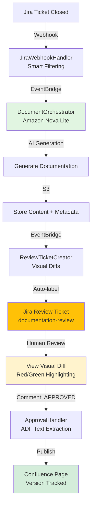

# Kinexus AI

Kinexus AI is a human-supervised documentation assistant powered by AWS serverless architecture. It automatically detects changes in Jira tickets, generates documentation using Amazon Nova Lite (AWS Bedrock), and orchestrates human review workflows with visual diffs before publishing to Confluence.

## Features
- **🤖 AI-Powered Documentation Generation** - Uses Amazon Nova Lite (AWS Bedrock) to analyze Jira tickets and generate contextual documentation
- **👁️ Visual Diff Review** - HTML diffs with red/green highlighting for easy change review
- **✅ Jira-Based Approval Workflow** - Simple comment-based approval (APPROVED/REJECTED/NEEDS REVISION)
- **🔄 Automatic Confluence Publishing** - Approved documentation automatically published to Confluence
- **🖼️ Image Change Detection** - Identifies when images need updating separate from text changes
- **📊 Event-Driven Architecture** - AWS EventBridge orchestrates Lambda functions for reliable workflows
- **🔗 Full Integration** - Connects Jira, AWS Bedrock, S3, DynamoDB, and Confluence seamlessly

## Production Deployment (AWS)

Kinexus AI is deployed as a serverless application on AWS:

```bash
# Deploy to AWS (via GitHub Actions)
git push origin develop

# Or deploy manually with CDK
cd infrastructure
cdk deploy --context environment=development \
  --context jira_base_url=$JIRA_BASE_URL \
  --context jira_email=$JIRA_EMAIL \
  --context jira_api_token=$JIRA_API_TOKEN \
  --context confluence_url=$CONFLUENCE_URL
```

**Production Endpoints:**
- API: `https://{api-id}.execute-api.{region}.amazonaws.com/prod/`
- Jira Webhook: `{api-endpoint}/webhooks/jira`
- Approval Webhook: `{api-endpoint}/webhooks/approval`
- Documents API: `{api-endpoint}/documents`

*(Replace `{api-id}` and `{region}` with your actual values from CloudFormation outputs)*

**📚 Complete Documentation**: [docs/README.md](docs/README.md) - Comprehensive guides for development, deployment, and administration

## Architecture Overview

Kinexus AI uses a serverless event-driven architecture:



**Key Components:**
- **5 Lambda Functions** - Webhook handlers, orchestrator, review ticket creator, approval handler
- **EventBridge** - Event routing (ChangeDetected → DocumentGenerated → DocumentationPublished)
- **DynamoDB** - Change tracking and document metadata
- **S3** - Document storage and HTML diffs
- **API Gateway** - REST endpoints for webhooks and queries

For complete workflow details, see:
- **[APPROVAL_WORKFLOW.md](APPROVAL_WORKFLOW.md)** - Complete Phase 1-4 workflow with implementation details
- **[docs/architecture.md](docs/architecture.md)** - AWS serverless architecture and component details
- **[docs/documentation-workflow.md](docs/documentation-workflow.md)** - Storage model and event patterns

## Quick Start Guide

### 1. Create and Transition a Jira Ticket

**Important:** The workflow only triggers when tickets transition from an **active work state** to completion.

**Required Transition:**
```
To Do → In Progress → Done  ✅ (triggers workflow)
```

**Will NOT Trigger:**
```
To Do → Done  ❌ (skipped - not from active state)
```

**Steps:**
1. Create a Jira ticket (e.g., `TOAST-42`)
2. Move to **"In Progress"** (or "In Review", "Testing", "QA")
3. Move to **"Done"** (or "Closed", "Resolved")

**Optional Labels** (bypass status requirement):
- Add label `needs-docs` to any ticket to force documentation generation regardless of status transitions

### 2. Review Ticket Auto-Created
Within ~2 minutes, a review ticket appears (e.g., `TOAST-43: Review: API Authentication Guide`)

### 3. Review the Visual Diff
Open the review ticket and click the **"View Full Diff (HTML)"** link to see:
- Side-by-side comparison (original vs. new)
- Red highlighting for deletions
- Green highlighting for additions
- Image change warnings

### 4. Approve or Reject (Two-Step Process)

**⚠️ IMPORTANT:** The approval workflow requires both a comment AND a status change.

**Step 1: Add Comment**
Comment on the review ticket with one of:
- `APPROVED` - Approve for publication
- `REJECTED` - Reject and mark for regeneration
- `NEEDS REVISION` - Request specific changes

**Step 2: Move Ticket to "Done"**
After commenting, transition the review ticket to **"Done"** status. This triggers the webhook that processes your approval decision.

**Note:** Commenting alone will NOT trigger the workflow. You must move the ticket to Done.

### 5. Documentation Published
If approved, documentation automatically publishes to Confluence with version tracking and audit trail.

## Documentation

### 🎯 Quick Links
- **[Approval Workflow](APPROVAL_WORKFLOW.md)** - ⭐ **START HERE** - Complete Phase 1-4 workflow with mermaid diagrams
- **[Atlassian Setup Guide](docs/atlassian-setup-guide.md)** - Step-by-step Jira/Confluence setup with official links
- **[Deployment](docs/deployment.md)** - Fork-and-deploy via GitHub Actions or manual CDK

### 📖 Complete Documentation
- [Architecture](docs/architecture.md) - AWS serverless architecture (Lambda, EventBridge, DynamoDB, S3)
- [AWS Deployment Setup](docs/aws-deployment-setup.md) - IAM permissions and infrastructure configuration
- [Documentation Workflow](docs/documentation-workflow.md) - Document lifecycle, storage model, label requirements
- [Development](docs/development.md) - Local development with Docker/FastAPI stack
- [Testing](docs/testing.md) - Test suite and coverage
- [Security](docs/security.md) - Security policies and best practices
- [Integrations](docs/integrations.md) - External system connections
- [Operations](docs/operations.md) - Operational procedures
- [Progress & Plans](docs/progress.md) - Project status and roadmap

## Local Development (FastAPI Stack)

For local development and testing with the FastAPI stack:

```bash
./quick-start.sh dev    # build containers, apply migrations, launch services
./quick-start.sh test   # verify containers and run smoke checks
```

Key endpoints once the stack is running:
- API docs: `http://localhost:3105/docs`
- Frontend (experimental): `http://localhost:3107`
- Mock Bedrock service: `http://localhost:3106`

**Note:** The production deployment uses AWS Lambda, not the local FastAPI stack. The local stack is for development and testing only.

## Testing
```bash
# Run all tests
pytest tests/

# Targeted tests
pytest tests/test_model_integration.py

# Coverage before PRs
pytest --cov=src tests/

# CI checks (black, isort, ruff)
./check-ci.sh
```

Ensure LocalStack and the mock Bedrock service are running if the suite touches AWS dependencies.

## Contributing
Read the [Contributor Guidelines](CONTRIBUTING.md) and the new [Repository Guidelines](AGENTS.md) for style and workflow expectations. We welcome issues and PRs that improve accuracy, automation, and integration coverage.

## License
Apache 2.0 — see [LICENSE](LICENSE).
