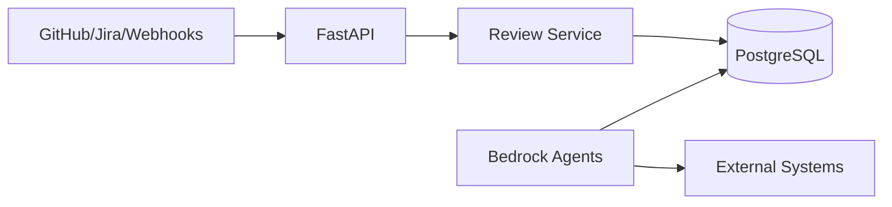

# Kinexus AI

Kinexus AI is a human-supervised documentation assistant. It ingests change events, queues reviews, and uses Bedrock-backed agents to propose updates that humans can approve. The project originated during the AWS AI Agent Hackathon and is evolving into a container-first platform with pluggable integrations.

## Features
- **FastAPI backend** with JWT auth, role-based permissions, and review workflows.
- **Agent toolbox** under `src/agents/` for Bedrock orchestration, persistent memory, and experimental ReAct/RAG flows.
- **Integration layer** with a working Monday.com adapter and scaffolding for GitHub, ServiceNow, SharePoint, Jira, and MCP-based tools.
- **Local development stack** powered by Podman/Docker Compose (Postgres, Redis, LocalStack, OpenSearch, mock Bedrock, optional React dashboard).
- **Prometheus metrics & structured logging** with request/agent/WebSocket telemetry and `/metrics` export.

## Getting Started
```bash
./scripts/dev-setup.sh   # build containers, apply migrations, launch services
./scripts/dev-test.sh    # verify containers and run smoke checks
```

Key endpoints once the stack is running:
- API docs: `http://localhost:3105/docs`
- Frontend (experimental): `http://localhost:3107`
- Mock Bedrock service: `http://localhost:3106`

**📚 Complete Documentation**: [docs/README.md](docs/README.md) - Comprehensive guides for development, deployment, and administration

## Architecture Snapshot


A detailed breakdown plus future-state plans lives in [docs/architecture.md](docs/architecture.md).

## Documentation
- [Architecture](docs/architecture.md)
- [Development](docs/development.md)
- [Deployment](docs/deployment.md)
- [Operations](docs/operations.md)
- [Testing](docs/testing.md)
- [Security](docs/security.md)
- [Documentation Workflow](docs/documentation-workflow.md)
- [Progress & Plans](docs/progress.md)
- [Integrations](docs/integrations.md)

Legacy plans and marketing material were archived under `docs/archive/legacy/` to keep the active docs lean.

## Testing
```bash
pytest tests/
pytest tests/test_model_integration.py      # targeted
pytest --cov=src tests/                     # coverage before PRs
```
Ensure LocalStack and the mock Bedrock service are running if the suite touches AWS dependencies.

## Contributing
Read the [Contributor Guidelines](CONTRIBUTING.md) and the new [Repository Guidelines](AGENTS.md) for style and workflow expectations. We welcome issues and PRs that improve accuracy, automation, and integration coverage.

## License
Apache 2.0 — see [LICENSE](LICENSE).
