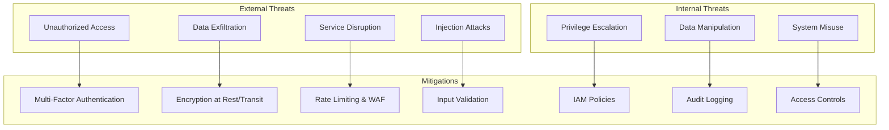
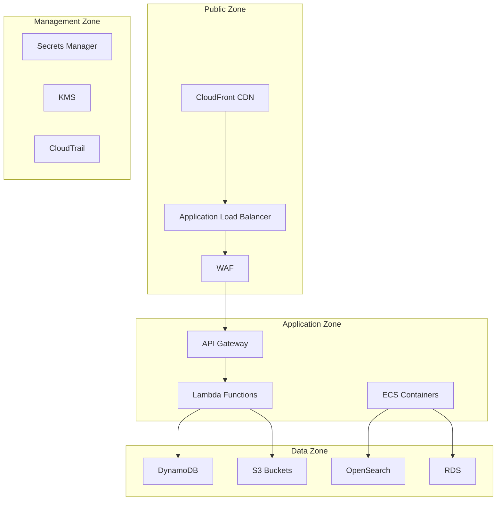

# Kinexus AI: Security & Compliance

## Table of Contents
- [Security Overview](#security-overview)
- [Security Architecture](#security-architecture)
- [Authentication & Authorization](#authentication--authorization)
- [Data Protection](#data-protection)
- [Network Security](#network-security)
- [Compliance Framework](#compliance-framework)
- [Security Monitoring](#security-monitoring)
- [Incident Response](#incident-response)
- [Security Best Practices](#security-best-practices)

## Security Overview

Kinexus AI implements enterprise-grade security controls following AWS Well-Architected Framework security pillar and industry best practices. The system is designed with defense-in-depth principles, zero-trust architecture, and comprehensive audit capabilities.

### Security Principles
- **Zero Trust**: Never trust, always verify
- **Least Privilege**: Minimal required permissions
- **Defense in Depth**: Multiple security layers
- **Data Sovereignty**: Customer data remains in customer's AWS account
- **Transparency**: Comprehensive audit logging
- **Privacy by Design**: Data protection built-in from inception

### Threat Model


## Security Architecture

### AWS Security Services Integration

#### Identity & Access Management
```yaml
Security_Services:
  Identity:
    - AWS IAM (Roles, Policies, Users)
    - AWS Cognito (User pools, Identity pools)
    - AWS SSO (Enterprise identity integration)
    
  Data_Protection:
    - AWS KMS (Key management)
    - AWS Secrets Manager (Credential management)
    - AWS Certificate Manager (TLS certificates)
    
  Network_Security:
    - AWS VPC (Network isolation)
    - AWS WAF (Web application firewall)
    - AWS Shield (DDoS protection)
    
  Monitoring:
    - AWS CloudTrail (API auditing)
    - AWS Config (Compliance monitoring)
    - AWS GuardDuty (Threat detection)
    - AWS Security Hub (Security posture)
```

#### Security Zones Architecture


### Infrastructure Security

#### VPC Configuration
```python
# infrastructure/security/vpc.py
class SecureVPCStack(Stack):
    def __init__(self, scope: Construct, construct_id: str, **kwargs):
        super().__init__(scope, construct_id, **kwargs)
        
        # VPC with multiple AZs
        self.vpc = ec2.Vpc(
            self, "KinexusSecureVPC",
            max_azs=3,
            cidr="10.0.0.0/16",
            subnet_configuration=[
                ec2.SubnetConfiguration(
                    name="Public",
                    subnet_type=ec2.SubnetType.PUBLIC,
                    cidr_mask=24
                ),
                ec2.SubnetConfiguration(
                    name="Private",
                    subnet_type=ec2.SubnetType.PRIVATE_WITH_EGRESS,
                    cidr_mask=24
                ),
                ec2.SubnetConfiguration(
                    name="Isolated",
                    subnet_type=ec2.SubnetType.PRIVATE_ISOLATED,
                    cidr_mask=24
                )
            ],
            enable_dns_hostnames=True,
            enable_dns_support=True
        )
        
        # VPC Flow Logs
        vpc_flow_log_role = iam.Role(
            self, "VPCFlowLogRole",
            assumed_by=iam.ServicePrincipal("vpc-flow-logs.amazonaws.com"),
            managed_policies=[
                iam.ManagedPolicy.from_aws_managed_policy_name(
                    "service-role/VPCFlowLogsDeliveryRolePolicy"
                )
            ]
        )
        
        ec2.FlowLog(
            self, "VPCFlowLog",
            resource_type=ec2.FlowLogResourceType.from_vpc(self.vpc),
            destination=ec2.FlowLogDestination.to_cloud_watch_logs(
                log_group=logs.LogGroup(
                    self, "VPCFlowLogGroup",
                    retention=logs.RetentionDays.ONE_MONTH
                ),
                iam_role=vpc_flow_log_role
            )
        )
        
        # Security Groups
        self.create_security_groups()
    
    def create_security_groups(self):
        """Create restrictive security groups"""
        
        # Lambda security group
        self.lambda_sg = ec2.SecurityGroup(
            self, "LambdaSecurityGroup",
            vpc=self.vpc,
            description="Security group for Lambda functions",
            allow_all_outbound=False
        )
        
        # Only allow HTTPS outbound
        self.lambda_sg.add_egress_rule(
            peer=ec2.Peer.any_ipv4(),
            connection=ec2.Port.tcp(443),
            description="HTTPS outbound"
        )
        
        # Database security group
        self.db_sg = ec2.SecurityGroup(
            self, "DatabaseSecurityGroup", 
            vpc=self.vpc,
            description="Security group for databases",
            allow_all_outbound=False
        )
        
        # Only allow access from Lambda
        self.db_sg.add_ingress_rule(
            peer=self.lambda_sg,
            connection=ec2.Port.tcp(443),
            description="Lambda to database"
        )
```

## Authentication & Authorization

### Multi-Factor Authentication
```python
# src/auth/mfa.py
class MFAManager:
    def __init__(self):
        self.cognito = boto3.client('cognito-idp')
        self.totp = pyotp.TOTP
        
    async def setup_mfa(self, user_id: str, phone_number: str = None):
        """Setup MFA for user"""
        # Generate TOTP secret
        secret = pyotp.random_base32()
        
        # Store encrypted secret
        await self.store_mfa_secret(user_id, secret)
        
        # Generate QR code for TOTP setup
        totp_uri = pyotp.totp.TOTP(secret).provisioning_uri(
            name=user_id,
            issuer_name="Kinexus AI"
        )
        
        qr_code = self.generate_qr_code(totp_uri)
        
        # Optional SMS backup
        if phone_number:
            await self.setup_sms_mfa(user_id, phone_number)
        
        return {
            'secret': secret,
            'qr_code': qr_code,
            'backup_codes': self.generate_backup_codes(user_id)
        }
    
    async def verify_mfa(self, user_id: str, token: str) -> bool:
        """Verify MFA token"""
        secret = await self.get_mfa_secret(user_id)
        if not secret:
            return False
            
        totp = pyotp.TOTP(secret)
        
        # Check current token and allow for clock skew
        return totp.verify(token, valid_window=1)
    
    async def store_mfa_secret(self, user_id: str, secret: str):
        """Store encrypted MFA secret"""
        kms = boto3.client('kms')
        
        # Encrypt secret with user-specific key
        encrypted_secret = kms.encrypt(
            KeyId=f"alias/kinexus-user-{user_id}",
            Plaintext=secret
        )
        
        # Store in Secrets Manager
        secrets_manager = boto3.client('secretsmanager')
        secrets_manager.create_secret(
            Name=f"kinexus/mfa/{user_id}",
            SecretString=base64.b64encode(
                encrypted_secret['CiphertextBlob']
            ).decode()
        )
```

### Role-Based Access Control (RBAC)
```yaml
# config/rbac.yaml
roles:
  admin:
    permissions:
      - system:*
      - documents:*
      - users:*
      - integrations:*
    
  editor:
    permissions:
      - documents:read
      - documents:write
      - documents:review
      - quality:read
    
  reviewer:
    permissions:
      - documents:read
      - documents:review
      - quality:read
    
  viewer:
    permissions:
      - documents:read
      - quality:read

policies:
  document_access:
    effect: allow
    actions:
      - documents:read
      - documents:write
    resources:
      - document/*
    conditions:
      team_member: true
      
  admin_only:
    effect: allow
    actions:
      - system:*
    resources:
      - "*"
    conditions:
      role: admin
```

### API Authentication
```python
# src/auth/api_auth.py
class APIAuthenticator:
    def __init__(self):
        self.jwt_secret = self.get_jwt_secret()
        self.api_key_table = "kinexus-api-keys"
        
    async def authenticate_request(self, request):
        """Authenticate API request"""
        auth_header = request.headers.get('Authorization')
        
        if not auth_header:
            raise AuthenticationError("Missing authorization header")
        
        if auth_header.startswith('Bearer '):
            return await self.verify_jwt_token(auth_header[7:])
        elif auth_header.startswith('ApiKey '):
            return await self.verify_api_key(auth_header[7:])
        else:
            raise AuthenticationError("Invalid authorization format")
    
    async def verify_jwt_token(self, token: str):
        """Verify JWT token"""
        try:
            payload = jwt.decode(
                token,
                self.jwt_secret,
                algorithms=['HS256'],
                options={"verify_exp": True}
            )
            
            # Additional claims validation
            if not payload.get('sub'):
                raise AuthenticationError("Missing subject claim")
            
            # Check token against revocation list
            if await self.is_token_revoked(payload.get('jti')):
                raise AuthenticationError("Token has been revoked")
            
            return AuthContext(
                user_id=payload['sub'],
                roles=payload.get('roles', []),
                permissions=payload.get('permissions', []),
                token_id=payload.get('jti')
            )
            
        except jwt.ExpiredSignatureError:
            raise AuthenticationError("Token has expired")
        except jwt.InvalidTokenError as e:
            raise AuthenticationError(f"Invalid token: {str(e)}")
    
    async def verify_api_key(self, api_key: str):
        """Verify API key"""
        # Hash the API key for lookup
        key_hash = hashlib.sha256(api_key.encode()).hexdigest()
        
        dynamodb = boto3.resource('dynamodb')
        table = dynamodb.Table(self.api_key_table)
        
        try:
            response = table.get_item(Key={'key_hash': key_hash})
            
            if 'Item' not in response:
                raise AuthenticationError("Invalid API key")
            
            key_data = response['Item']
            
            # Check if key is active
            if not key_data.get('active', False):
                raise AuthenticationError("API key is disabled")
            
            # Check expiration
            if key_data.get('expires_at'):
                expires_at = datetime.fromisoformat(key_data['expires_at'])
                if datetime.utcnow() > expires_at:
                    raise AuthenticationError("API key has expired")
            
            # Update last used timestamp
            table.update_item(
                Key={'key_hash': key_hash},
                UpdateExpression='SET last_used = :timestamp',
                ExpressionAttributeValues={
                    ':timestamp': datetime.utcnow().isoformat()
                }
            )
            
            return AuthContext(
                user_id=key_data['user_id'],
                roles=key_data.get('roles', []),
                permissions=key_data.get('permissions', []),
                api_key_id=key_data['key_id']
            )
            
        except ClientError as e:
            raise AuthenticationError(f"Authentication failed: {str(e)}")
```

## Data Protection

### Encryption Strategy

#### Encryption at Rest
```python
# src/security/encryption.py
class EncryptionManager:
    def __init__(self):
        self.kms = boto3.client('kms')
        self.master_key_id = os.environ['KMS_MASTER_KEY_ID']
        
    def create_data_key(self, context: dict = None):
        """Create data encryption key"""
        response = self.kms.generate_data_key(
            KeyId=self.master_key_id,
            KeySpec='AES_256',
            EncryptionContext=context or {}
        )
        
        return {
            'plaintext_key': response['Plaintext'],
            'encrypted_key': response['CiphertextBlob']
        }
    
    def encrypt_document(self, document_content: str, document_id: str):
        """Encrypt document content"""
        encryption_context = {
            'document_id': document_id,
            'service': 'kinexus-ai',
            'purpose': 'document_storage'
        }
        
        # Generate data key for this document
        data_key = self.create_data_key(encryption_context)
        
        # Encrypt content with data key
        cipher = AES.new(data_key['plaintext_key'][:32], AES.MODE_GCM)
        ciphertext, tag = cipher.encrypt_and_digest(
            document_content.encode('utf-8')
        )
        
        # Clear plaintext key from memory
        data_key['plaintext_key'] = None
        
        return {
            'encrypted_content': base64.b64encode(ciphertext).decode(),
            'encryption_tag': base64.b64encode(tag).decode(),
            'nonce': base64.b64encode(cipher.nonce).decode(),
            'encrypted_data_key': base64.b64encode(
                data_key['encrypted_key']
            ).decode(),
            'encryption_context': encryption_context
        }
    
    def decrypt_document(self, encrypted_data: dict):
        """Decrypt document content"""
        # Decrypt data key
        response = self.kms.decrypt(
            CiphertextBlob=base64.b64decode(
                encrypted_data['encrypted_data_key']
            ),
            EncryptionContext=encrypted_data['encryption_context']
        )
        
        data_key = response['Plaintext']
        
        try:
            # Decrypt content
            cipher = AES.new(
                data_key[:32],
                AES.MODE_GCM,
                nonce=base64.b64decode(encrypted_data['nonce'])
            )
            
            plaintext = cipher.decrypt_and_verify(
                base64.b64decode(encrypted_data['encrypted_content']),
                base64.b64decode(encrypted_data['encryption_tag'])
            )
            
            return plaintext.decode('utf-8')
            
        finally:
            # Clear key from memory
            data_key = None
```

#### Encryption in Transit
```yaml
# TLS Configuration
TLS_Configuration:
  minimum_version: "1.2"
  cipher_suites:
    - "ECDHE-RSA-AES256-GCM-SHA384"
    - "ECDHE-RSA-AES128-GCM-SHA256"
    - "ECDHE-RSA-AES256-SHA384"
  
  certificate_management:
    provider: "AWS Certificate Manager"
    auto_renewal: true
    validation: "DNS"
    
  api_gateway:
    security_policy: "TLS_1_2"
    endpoint_type: "REGIONAL"
    
  cloudfront:
    minimum_protocol_version: "TLSv1.2_2021"
    ssl_support_method: "sni-only"
```

### Data Loss Prevention (DLP)
```python
# src/security/dlp.py
class DataLossPreventionScanner:
    def __init__(self):
        self.patterns = self.load_dlp_patterns()
        self.comprehend = boto3.client('comprehend')
        
    def load_dlp_patterns(self):
        """Load DLP detection patterns"""
        return {
            'credit_card': re.compile(r'\b\d{4}[-\s]?\d{4}[-\s]?\d{4}[-\s]?\d{4}\b'),
            'ssn': re.compile(r'\b\d{3}-?\d{2}-?\d{4}\b'),
            'email': re.compile(r'\b[A-Za-z0-9._%+-]+@[A-Za-z0-9.-]+\.[A-Z|a-z]{2,}\b'),
            'phone': re.compile(r'\b\d{3}-?\d{3}-?\d{4}\b'),
            'aws_key': re.compile(r'AKIA[0-9A-Z]{16}'),
            'private_key': re.compile(r'-----BEGIN (RSA )?PRIVATE KEY-----')
        }
    
    async def scan_content(self, content: str, document_id: str):
        """Scan content for sensitive data"""
        findings = []
        
        # Pattern-based detection
        for pattern_name, pattern in self.patterns.items():
            matches = pattern.findall(content)
            if matches:
                findings.append({
                    'type': pattern_name,
                    'count': len(matches),
                    'confidence': 0.95,
                    'action': 'redact' if pattern_name in ['credit_card', 'ssn'] else 'flag'
                })
        
        # AI-powered PII detection
        try:
            pii_response = self.comprehend.detect_pii_entities(
                Text=content[:5000],  # Comprehend limit
                LanguageCode='en'
            )
            
            for entity in pii_response['Entities']:
                if entity['Score'] > 0.8:  # High confidence
                    findings.append({
                        'type': entity['Type'],
                        'confidence': entity['Score'],
                        'location': {
                            'start': entity['BeginOffset'],
                            'end': entity['EndOffset']
                        },
                        'action': 'review'
                    })
                    
        except Exception as e:
            logger.warning(f"PII detection failed: {str(e)}")
        
        # Log findings
        if findings:
            await self.log_dlp_findings(document_id, findings)
        
        return findings
    
    async def redact_content(self, content: str, findings: list):
        """Redact sensitive content based on findings"""
        redacted_content = content
        
        # Sort findings by location (end to start to preserve positions)
        location_findings = [f for f in findings if 'location' in f]
        location_findings.sort(key=lambda x: x['location']['end'], reverse=True)
        
        for finding in location_findings:
            if finding['action'] == 'redact':
                start = finding['location']['start']
                end = finding['location']['end']
                redacted_content = (
                    redacted_content[:start] +
                    '[REDACTED]' +
                    redacted_content[end:]
                )
        
        return redacted_content
```

## Network Security

### Web Application Firewall (WAF)
```python
# infrastructure/security/waf.py
class KinexusWAFStack(Stack):
    def __init__(self, scope: Construct, construct_id: str, **kwargs):
        super().__init__(scope, construct_id, **kwargs)
        
        # Create WAF Web ACL
        self.web_acl = wafv2.CfnWebACL(
            self, "KinexusWebACL",
            scope="CLOUDFRONT",
            default_action=wafv2.CfnWebACL.DefaultActionProperty(
                allow=wafv2.CfnWebACL.AllowActionProperty()
            ),
            rules=[
                # Rate limiting rule
                wafv2.CfnWebACL.RuleProperty(
                    name="RateLimitRule",
                    priority=1,
                    statement=wafv2.CfnWebACL.StatementProperty(
                        rate_based_statement=wafv2.CfnWebACL.RateBasedStatementProperty(
                            limit=1000,  # requests per 5 minutes
                            aggregate_key_type="IP"
                        )
                    ),
                    action=wafv2.CfnWebACL.RuleActionProperty(
                        block=wafv2.CfnWebACL.BlockActionProperty()
                    ),
                    visibility_config=wafv2.CfnWebACL.VisibilityConfigProperty(
                        sampled_requests_enabled=True,
                        cloud_watch_metrics_enabled=True,
                        metric_name="RateLimitRule"
                    )
                ),
                
                # AWS Managed Common Rule Set
                wafv2.CfnWebACL.RuleProperty(
                    name="AWSManagedRulesCommonRuleSet",
                    priority=2,
                    override_action=wafv2.CfnWebACL.OverrideActionProperty(
                        none={}
                    ),
                    statement=wafv2.CfnWebACL.StatementProperty(
                        managed_rule_group_statement=wafv2.CfnWebACL.ManagedRuleGroupStatementProperty(
                            vendor_name="AWS",
                            name="AWSManagedRulesCommonRuleSet"
                        )
                    ),
                    visibility_config=wafv2.CfnWebACL.VisibilityConfigProperty(
                        sampled_requests_enabled=True,
                        cloud_watch_metrics_enabled=True,
                        metric_name="CommonRuleSetMetric"
                    )
                ),
                
                # Block suspicious user agents
                wafv2.CfnWebACL.RuleProperty(
                    name="BlockSuspiciousUserAgents",
                    priority=3,
                    statement=wafv2.CfnWebACL.StatementProperty(
                        byte_match_statement=wafv2.CfnWebACL.ByteMatchStatementProperty(
                            search_string="bot",
                            field_to_match=wafv2.CfnWebACL.FieldToMatchProperty(
                                single_header=wafv2.CfnWebACL.SingleHeaderProperty(
                                    name="user-agent"
                                )
                            ),
                            text_transformations=[
                                wafv2.CfnWebACL.TextTransformationProperty(
                                    priority=0,
                                    type="LOWERCASE"
                                )
                            ],
                            positional_constraint="CONTAINS"
                        )
                    ),
                    action=wafv2.CfnWebACL.RuleActionProperty(
                        block=wafv2.CfnWebACL.BlockActionProperty()
                    ),
                    visibility_config=wafv2.CfnWebACL.VisibilityConfigProperty(
                        sampled_requests_enabled=True,
                        cloud_watch_metrics_enabled=True,
                        metric_name="BlockSuspiciousUserAgents"
                    )
                )
            ],
            visibility_config=wafv2.CfnWebACL.VisibilityConfigProperty(
                sampled_requests_enabled=True,
                cloud_watch_metrics_enabled=True,
                metric_name="KinexusWebACL"
            )
        )
```

### Network Access Controls
```yaml
# Network Security Configuration
network_security:
  vpc_endpoints:
    - service: "com.amazonaws.vpce.us-east-1.s3"
      type: "Gateway"
      policy: "allow_kinexus_buckets_only"
      
    - service: "com.amazonaws.vpce.us-east-1.dynamodb"
      type: "Gateway"
      policy: "allow_kinexus_tables_only"
      
    - service: "com.amazonaws.vpce.us-east-1.bedrock"
      type: "Interface"
      policy: "allow_kinexus_models_only"
  
  nacls:
    public_subnet:
      inbound:
        - rule: 100
          protocol: tcp
          port_range: "80"
          cidr: "0.0.0.0/0"
          action: allow
        - rule: 110
          protocol: tcp
          port_range: "443"
          cidr: "0.0.0.0/0"
          action: allow
      outbound:
        - rule: 100
          protocol: tcp
          port_range: "80"
          cidr: "0.0.0.0/0"
          action: allow
        - rule: 110
          protocol: tcp
          port_range: "443"
          cidr: "0.0.0.0/0"
          action: allow
    
    private_subnet:
      inbound:
        - rule: 100
          protocol: tcp
          port_range: "443"
          cidr: "10.0.0.0/16"
          action: allow
      outbound:
        - rule: 100
          protocol: tcp
          port_range: "443"
          cidr: "0.0.0.0/0"
          action: allow
```

## Compliance Framework

### SOC 2 Type II Compliance
```yaml
# config/compliance/soc2.yaml
soc2_controls:
  security:
    - control_id: "CC6.1"
      description: "Logical and physical access controls"
      implementation:
        - Multi-factor authentication required
        - Role-based access control
        - Regular access reviews
      evidence:
        - IAM policies and roles
        - MFA configuration
        - Access review reports
        
    - control_id: "CC6.2"
      description: "System access monitoring"
      implementation:
        - CloudTrail logging
        - Real-time alerting
        - Automated response
      evidence:
        - CloudTrail logs
        - Security Hub findings
        - Incident response records
  
  availability:
    - control_id: "CC7.1"
      description: "System monitoring and alerting"
      implementation:
        - 99.9% uptime SLA
        - Multi-AZ deployment
        - Automated failover
      evidence:
        - Uptime reports
        - Monitoring dashboards
        - Incident reports
        
  processing_integrity:
    - control_id: "CC8.1"
      description: "Data processing controls"
      implementation:
        - Input validation
        - Data integrity checks
        - Error handling
      evidence:
        - Code review reports
        - Test results
        - Error logs
        
  confidentiality:
    - control_id: "CC9.1"
      description: "Data encryption and protection"
      implementation:
        - Encryption at rest and in transit
        - Data classification
        - Access controls
      evidence:
        - Encryption configuration
        - DLP scan results
        - Access logs
```

### GDPR Compliance
```python
# src/compliance/gdpr.py
class GDPRComplianceManager:
    def __init__(self):
        self.data_registry = DataRegistry()
        self.consent_manager = ConsentManager()
        
    async def handle_data_subject_request(self, request_type: str, user_id: str):
        """Handle GDPR data subject requests"""
        
        if request_type == "access":
            return await self.export_user_data(user_id)
        elif request_type == "portability":
            return await self.export_user_data(user_id, format="machine_readable")
        elif request_type == "rectification":
            return await self.update_user_data(user_id)
        elif request_type == "erasure":
            return await self.delete_user_data(user_id)
        elif request_type == "restriction":
            return await self.restrict_user_data_processing(user_id)
        elif request_type == "objection":
            return await self.stop_user_data_processing(user_id)
        else:
            raise ValueError(f"Unknown request type: {request_type}")
    
    async def export_user_data(self, user_id: str, format: str = "human_readable"):
        """Export all user data (Article 15 & 20)"""
        user_data = {
            'personal_data': await self.get_personal_data(user_id),
            'documents_created': await self.get_user_documents(user_id),
            'access_logs': await self.get_access_logs(user_id),
            'preferences': await self.get_user_preferences(user_id),
            'consent_records': await self.consent_manager.get_consent_history(user_id)
        }
        
        if format == "machine_readable":
            return json.dumps(user_data, indent=2)
        else:
            return self.format_human_readable_export(user_data)
    
    async def delete_user_data(self, user_id: str):
        """Delete all user data (Article 17)"""
        # Check if deletion is legally required
        if not await self.can_delete_user_data(user_id):
            raise ComplianceError("Data deletion not permitted due to legal obligations")
        
        # Soft delete with anonymization
        await self.anonymize_user_data(user_id)
        
        # Schedule hard deletion after retention period
        await self.schedule_hard_deletion(user_id, days=30)
        
        # Notify downstream systems
        await self.notify_data_deletion(user_id)
        
        return {
            'status': 'completed',
            'anonymized_at': datetime.utcnow().isoformat(),
            'hard_deletion_scheduled': (datetime.utcnow() + timedelta(days=30)).isoformat()
        }
    
    async def track_data_processing(self, user_id: str, purpose: str, legal_basis: str):
        """Track data processing activities (Article 30)"""
        processing_record = {
            'user_id': user_id,
            'purpose': purpose,
            'legal_basis': legal_basis,
            'timestamp': datetime.utcnow().isoformat(),
            'data_categories': await self.get_data_categories_for_purpose(purpose),
            'retention_period': await self.get_retention_period(purpose),
            'recipients': await self.get_data_recipients(purpose)
        }
        
        await self.data_registry.record_processing_activity(processing_record)
```

## Security Monitoring

### Security Information and Event Management (SIEM)
```python
# src/security/siem.py
class SecurityEventManager:
    def __init__(self):
        self.cloudwatch = boto3.client('cloudwatch')
        self.sns = boto3.client('sns')
        self.security_topic = os.environ['SECURITY_ALERTS_TOPIC']
        
    async def process_security_event(self, event):
        """Process and analyze security events"""
        
        # Classify event severity
        severity = await self.classify_event_severity(event)
        
        # Check for patterns indicating attacks
        threat_indicators = await self.analyze_threat_indicators(event)
        
        # Create security incident if needed
        if severity in ['HIGH', 'CRITICAL'] or threat_indicators:
            incident = await self.create_security_incident(event, severity)
            await self.notify_security_team(incident)
        
        # Log to CloudWatch
        await self.log_security_event(event, severity)
        
        # Update security metrics
        await self.update_security_metrics(event, severity)
    
    async def classify_event_severity(self, event):
        """Classify event severity based on type and context"""
        severity_rules = {
            'authentication_failure': {
                'threshold': 5,
                'window': 300,  # 5 minutes
                'severity': 'MEDIUM'
            },
            'privilege_escalation': {
                'threshold': 1,
                'window': 60,
                'severity': 'HIGH'
            },
            'data_access_anomaly': {
                'threshold': 3,
                'window': 600,
                'severity': 'HIGH'
            },
            'unauthorized_api_access': {
                'threshold': 10,
                'window': 300,
                'severity': 'CRITICAL'
            }
        }
        
        event_type = event.get('event_type')
        rule = severity_rules.get(event_type, {'severity': 'LOW'})
        
        # Check if threshold exceeded
        recent_events = await self.get_recent_events(
            event_type, 
            rule.get('window', 300)
        )
        
        if len(recent_events) >= rule.get('threshold', 1):
            return rule['severity']
        else:
            return 'LOW'
    
    async def analyze_threat_indicators(self, event):
        """Analyze event for threat indicators"""
        indicators = []
        
        # Check against known bad IPs
        source_ip = event.get('source_ip')
        if source_ip and await self.is_malicious_ip(source_ip):
            indicators.append('malicious_ip')
        
        # Check for suspicious user agents
        user_agent = event.get('user_agent', '')
        if self.is_suspicious_user_agent(user_agent):
            indicators.append('suspicious_user_agent')
        
        # Check for anomalous access patterns
        if await self.is_anomalous_access_pattern(event):
            indicators.append('anomalous_access')
        
        # Check for data exfiltration patterns
        if await self.is_data_exfiltration_pattern(event):
            indicators.append('data_exfiltration')
        
        return indicators
```

### Automated Threat Response
```python
# src/security/automated_response.py
class AutomatedThreatResponse:
    def __init__(self):
        self.waf = boto3.client('wafv2')
        self.iam = boto3.client('iam')
        self.lambda_client = boto3.client('lambda')
        
    async def respond_to_threat(self, incident):
        """Automated response to security threats"""
        
        threat_type = incident.get('threat_type')
        severity = incident.get('severity')
        
        response_actions = []
        
        if threat_type == 'brute_force_attack':
            # Block IP address
            await self.block_ip_address(incident['source_ip'])
            response_actions.append('ip_blocked')
            
        elif threat_type == 'privilege_escalation':
            # Disable user account
            await self.disable_user_account(incident['user_id'])
            response_actions.append('user_disabled')
            
        elif threat_type == 'data_exfiltration':
            # Revoke API keys
            await self.revoke_api_keys(incident['user_id'])
            # Enable enhanced monitoring
            await self.enable_enhanced_monitoring(incident['user_id'])
            response_actions.append('api_keys_revoked')
            response_actions.append('enhanced_monitoring_enabled')
            
        elif threat_type == 'malware_detected':
            # Quarantine affected documents
            await self.quarantine_documents(incident['affected_documents'])
            response_actions.append('documents_quarantined')
        
        # Log response actions
        await self.log_response_actions(incident['incident_id'], response_actions)
        
        return response_actions
    
    async def block_ip_address(self, ip_address: str, duration_hours: int = 24):
        """Block IP address in WAF"""
        ip_set_id = await self.get_blocked_ips_set()
        
        current_ips = await self.get_ip_set_addresses(ip_set_id)
        current_ips.append(f"{ip_address}/32")
        
        await self.waf.update_ip_set(
            Scope='CLOUDFRONT',
            Id=ip_set_id,
            Addresses=current_ips
        )
        
        # Schedule removal
        await self.schedule_ip_unblock(ip_address, duration_hours)
    
    async def disable_user_account(self, user_id: str):
        """Disable user account and revoke sessions"""
        
        # Disable in Cognito
        cognito = boto3.client('cognito-idp')
        await cognito.admin_disable_user(
            UserPoolId=os.environ['USER_POOL_ID'],
            Username=user_id
        )
        
        # Revoke all active sessions
        await cognito.admin_user_global_sign_out(
            UserPoolId=os.environ['USER_POOL_ID'],
            Username=user_id
        )
        
        # Add to security watch list
        await self.add_to_watch_list(user_id, reason="automated_security_response")
```

## Incident Response

### Security Incident Response Plan
```yaml
# config/incident_response.yaml
incident_response:
  severity_levels:
    critical:
      definition: "Immediate threat to system or data integrity"
      response_time: "15 minutes"
      escalation: "CISO, Security Team, Engineering Leadership"
      actions:
        - "Activate incident response team"
        - "Implement containment measures"
        - "Preserve evidence"
        - "Begin forensic analysis"
        
    high:
      definition: "Significant security event requiring immediate attention"
      response_time: "1 hour"
      escalation: "Security Team, Engineering Manager"
      actions:
        - "Assess impact and scope"
        - "Implement containment if needed"
        - "Document findings"
        
    medium:
      definition: "Security event requiring investigation"
      response_time: "4 hours"
      escalation: "Security Team"
      actions:
        - "Investigate and document"
        - "Implement preventive measures"
        
    low:
      definition: "Minor security event for monitoring"
      response_time: "24 hours"
      escalation: "Security Team (routine review)"
      actions:
        - "Log and monitor"
        - "Review during next security meeting"

  communication_plan:
    internal:
      - "Security team notification (immediate)"
      - "Executive briefing (within 2 hours for critical/high)"
      - "All-hands communication (as needed)"
      
    external:
      - "Customer notification (if data breach)"
      - "Regulatory notification (as required by law)"
      - "Public disclosure (if warranted)"
      
  recovery_procedures:
    - "Restore from clean backups"
    - "Apply security patches"
    - "Reset compromised credentials"
    - "Review and update security controls"
    - "Conduct post-incident review"
```

### Forensic Evidence Collection
```python
# src/security/forensics.py
class ForensicCollector:
    def __init__(self):
        self.s3 = boto3.client('s3')
        self.cloudtrail = boto3.client('cloudtrail')
        self.evidence_bucket = os.environ['FORENSIC_EVIDENCE_BUCKET']
        
    async def collect_incident_evidence(self, incident_id: str, start_time: datetime, end_time: datetime):
        """Collect forensic evidence for security incident"""
        
        evidence_collection = {
            'incident_id': incident_id,
            'collection_timestamp': datetime.utcnow().isoformat(),
            'collection_scope': {
                'start_time': start_time.isoformat(),
                'end_time': end_time.isoformat()
            },
            'evidence_types': []
        }
        
        # Collect CloudTrail logs
        cloudtrail_evidence = await self.collect_cloudtrail_logs(start_time, end_time)
        evidence_collection['evidence_types'].append({
            'type': 'cloudtrail_logs',
            'location': cloudtrail_evidence['s3_location'],
            'hash': cloudtrail_evidence['hash']
        })
        
        # Collect application logs
        app_logs_evidence = await self.collect_application_logs(start_time, end_time)
        evidence_collection['evidence_types'].append({
            'type': 'application_logs',
            'location': app_logs_evidence['s3_location'],
            'hash': app_logs_evidence['hash']
        })
        
        # Collect system snapshots
        if incident_id in ['privilege_escalation', 'malware_detected']:
            snapshot_evidence = await self.collect_system_snapshots()
            evidence_collection['evidence_types'].append({
                'type': 'system_snapshots',
                'location': snapshot_evidence['s3_location'],
                'hash': snapshot_evidence['hash']
            })
        
        # Create evidence manifest
        manifest_location = await self.create_evidence_manifest(evidence_collection)
        
        # Generate chain of custody record
        await self.create_chain_of_custody(incident_id, evidence_collection)
        
        return {
            'evidence_manifest': manifest_location,
            'evidence_count': len(evidence_collection['evidence_types']),
            'collection_complete': True
        }
    
    async def create_chain_of_custody(self, incident_id: str, evidence_collection: dict):
        """Create forensic chain of custody record"""
        
        custody_record = {
            'incident_id': incident_id,
            'evidence_id': f"evidence_{incident_id}_{int(time.time())}",
            'collected_by': 'kinexus_automated_forensics',
            'collected_at': datetime.utcnow().isoformat(),
            'evidence_integrity': {
                'hashes': [item['hash'] for item in evidence_collection['evidence_types']],
                'verification_method': 'SHA-256'
            },
            'custody_chain': [
                {
                    'timestamp': datetime.utcnow().isoformat(),
                    'action': 'evidence_collected',
                    'actor': 'kinexus_automated_forensics',
                    'location': self.evidence_bucket
                }
            ]
        }
        
        # Store chain of custody
        custody_key = f"chain_of_custody/{incident_id}/{custody_record['evidence_id']}.json"
        await self.s3.put_object(
            Bucket=self.evidence_bucket,
            Key=custody_key,
            Body=json.dumps(custody_record, indent=2),
            ServerSideEncryption='aws:kms',
            SSEKMSKeyId=os.environ['FORENSIC_KMS_KEY']
        )
        
        return custody_record['evidence_id']
```

## Security Best Practices

### Secure Development Lifecycle
```yaml
# config/secure_development.yaml
secure_development:
  code_review:
    required_reviewers: 2
    security_review_required: true
    automated_scans:
      - "SAST (Static Application Security Testing)"
      - "Dependency vulnerability scanning"
      - "Secret detection"
      
  testing:
    security_tests:
      - "Authentication bypass tests"
      - "Authorization tests"
      - "Input validation tests"
      - "SQL injection tests"
      - "XSS tests"
      - "CSRF tests"
      
  deployment:
    security_gates:
      - "All security tests pass"
      - "No high/critical vulnerabilities"
      - "Security review approval"
      - "Penetration test results reviewed"
```

### Infrastructure Security Checklist
```yaml
# Security Configuration Checklist
security_checklist:
  aws_account:
    - "Root account MFA enabled"
    - "CloudTrail enabled in all regions"
    - "Config enabled in all regions"
    - "GuardDuty enabled"
    - "Security Hub enabled"
    - "Trusted Advisor security checks reviewed"
    
  iam:
    - "Least privilege principle applied"
    - "No long-term access keys for users"
    - "Regular access review conducted"
    - "Cross-account roles properly configured"
    - "Service roles follow least privilege"
    
  networking:
    - "VPC flow logs enabled"
    - "Security groups follow least privilege"
    - "NACLs configured appropriately"
    - "VPC endpoints used where possible"
    - "No direct internet access to databases"
    
  data_protection:
    - "Encryption at rest enabled"
    - "Encryption in transit enforced"
    - "Key rotation enabled"
    - "Backup encryption enabled"
    - "Data classification implemented"
    
  monitoring:
    - "Real-time alerting configured"
    - "Log aggregation implemented"
    - "Anomaly detection enabled"
    - "Incident response procedures documented"
    - "Regular security assessments conducted"
```

This comprehensive security framework ensures Kinexus AI meets enterprise security requirements while maintaining usability and performance. The defense-in-depth approach provides multiple layers of protection against various threat vectors, and the compliance framework ensures regulatory requirements are met.