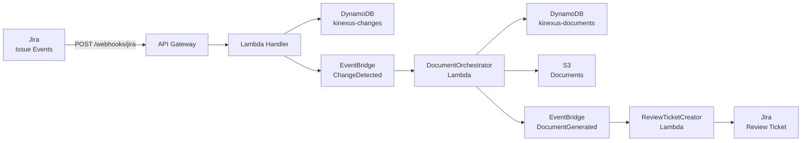

# Production API Reference

> **AWS Lambda Production Environment**
>
> This API reference documents the **production AWS Lambda webhook endpoints** deployed via API Gateway.
>
> **Local Development Environment**: For the full REST API with FastAPI, see [Local Development API Reference](local-dev-stack/api-reference.md).

## Base URL

```
https://{api-id}.execute-api.{region}.amazonaws.com/prod
```

Replace `{api-id}` and `{region}` with your actual API Gateway deployment values (found in CloudFormation outputs).

## Authentication

**None** - Production webhooks are publicly accessible. Security is provided by:
- Jira webhook secrets (signature validation)
- EventBridge event filtering
- Lambda IAM permissions

## Webhook Endpoints

### POST /webhooks/jira

Receives Jira issue events (created, updated, transitioned) to trigger documentation generation.

**Triggered By:**
- Jira webhook configured in Atlassian admin console
- Events: `jira:issue_updated` (status transitions)

**Request Headers:**
```
Content-Type: application/json
X-Atlassian-Webhook-Identifier: {webhook-id}
```

**Request Body:**
```json
{
  "webhookEvent": "jira:issue_updated",
  "issue_event_type_name": "issue_generic",
  "issue": {
    "id": "10001",
    "key": "TOAST-42",
    "fields": {
      "summary": "Add new API endpoint for user authentication",
      "description": "...",
      "status": {
        "name": "Done"
      },
      "labels": ["needs-docs", "api-change"]
    }
  },
  "changelog": {
    "items": [
      {
        "field": "status",
        "fromString": "In Progress",
        "toString": "Done"
      }
    ]
  }
}
```

**Response:**
```json
{
  "status": "received",
  "change_id": "jira_TOAST-42_1234567890.123456"
}
```

**Status Codes:**
- `200 OK` - Event received and processed
- `400 Bad Request` - Invalid event format
- `500 Internal Server Error` - Processing failed

**Workflow Triggered:**
1. JiraWebhookHandler Lambda validates event
2. Extracts change data and stores in DynamoDB (kinexus-changes table)
3. Emits `ChangeDetected` event to EventBridge
4. DocumentOrchestrator Lambda generates documentation
5. ReviewTicketCreator Lambda creates Jira review ticket

---

### POST /webhooks/approval

Receives Jira issue events for documentation approval workflow (review ticket status changes).

**Triggered By:**
- Jira webhook configured in Atlassian admin console
- Events: `jira:issue_updated` (review ticket moved to "Done")

**Request Headers:**
```
Content-Type: application/json
X-Atlassian-Webhook-Identifier: {webhook-id}
```

**Request Body:**
```json
{
  "webhookEvent": "jira:issue_updated",
  "issue_event_type_name": "issue_generic",
  "issue": {
    "id": "10025",
    "key": "TOAST-43",
    "fields": {
      "summary": "Review: Documentation for TOAST-42",
      "status": {
        "name": "Done"
      },
      "labels": ["documentation-review", "auto-generated", "kinexus-ai"],
      "comment": {
        "comments": [
          {
            "author": {
              "displayName": "John Reviewer"
            },
            "body": {
              "content": [
                {
                  "type": "paragraph",
                  "content": [
                    {
                      "type": "text",
                      "text": "APPROVED - Looks good to publish"
                    }
                  ]
                }
              ]
            },
            "created": "2025-01-20T15:30:00.000-0800"
          }
        ]
      }
    }
  },
  "changelog": {
    "items": [
      {
        "field": "status",
        "fromString": "In Progress",
        "toString": "Done"
      }
    ]
  }
}
```

**Response:**
```json
{
  "status": "received",
  "decision": "APPROVED",
  "document_id": "doc_jira_TOAST-42_1234567890.123456_1234567895.789012"
}
```

**Status Codes:**
- `200 OK` - Approval processed
- `400 Bad Request` - Invalid event or missing decision
- `404 Not Found` - Document not found
- `500 Internal Server Error` - Publishing failed

**Workflow Triggered:**
1. ApprovalHandler Lambda detects review ticket transition to "Done"
2. Fetches all comments via Jira REST API
3. Extracts decision (APPROVED/REJECTED/NEEDS REVISION) from latest comment
4. Retrieves document from DynamoDB using document ID from ticket description
5. If APPROVED: Publishes to Confluence (create or update page)
6. Updates document status in DynamoDB
7. Adds comment to original source ticket with Confluence link

**Decision Keywords:**
- `APPROVED` or `approve` - Publish to Confluence
- `REJECTED` or `reject` - Do not publish, close workflow
- `NEEDS REVISION` or `revise` - Request changes, keep review ticket open

---

## Event Flow

All webhooks follow the same general pattern:



## Error Handling

All webhook endpoints return structured error responses:

```json
{
  "error": "Invalid event format",
  "details": "Missing required field: issue.key",
  "timestamp": "2025-01-20T15:30:00.000Z"
}
```

## Monitoring

Production webhook invocations can be monitored via:
- **CloudWatch Logs**: `/aws/lambda/KinexusAIMVPStack-Develop-*`
- **CloudWatch Metrics**: Lambda invocation counts, errors, duration
- **DynamoDB Tables**: `kinexus-changes`, `kinexus-documents`
- **S3 Bucket**: `kinexus-documents-{account-id}-{region}`

## Configuration

Webhook URLs are available in CloudFormation stack outputs:

```bash
aws cloudformation describe-stacks \
  --stack-name KinexusAIMVPStack-Development \
  --query 'Stacks[0].Outputs' \
  --output json
```

Look for outputs:
- `WebhookAPIEndpoint` - Base API Gateway URL
- `JiraWebhookURL` - Full Jira webhook URL
- `ApprovalWebhookURL` - Full approval webhook URL
- `GitHubWebhookURL` - Full GitHub webhook URL

## See Also

- [Architecture](architecture.md) - AWS Lambda serverless architecture details
- [Documentation Workflow](documentation-workflow.md) - Complete Phase 1-7 workflow
- [Deployment Guide](deployment.md) - How to deploy webhook infrastructure
- [Local Development API](local-dev-stack/api-reference.md) - Full REST API for local testing
