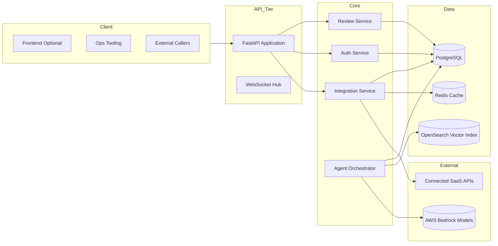
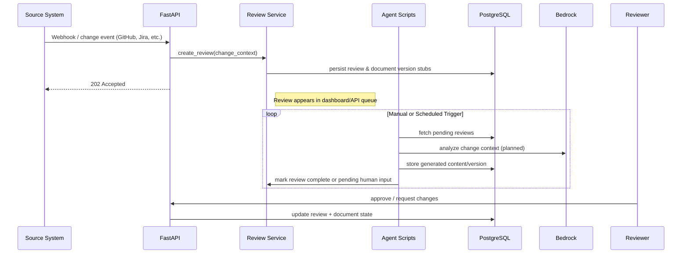

# Architecture

Kinexus AI combines a FastAPI service layer, asynchronous agent routines, and a PostgreSQL-backed review workflow. The current implementation focuses on reliable change intake and human-supervised documentation updates while keeping hooks in place for forthcoming autonomic features.

## High-Level Components


- **FastAPI Application** (`src/api`) exposes REST and WebSocket interfaces, wires authentication, and hosts review/document routers.
- **Core Services** (`src/core/services`) wrap domain logic for reviews, auth, integrations, metrics, and logging.
- **Agents Runtime** (`src/agents`) contains orchestration, RAG utilities, and Bedrock-facing helpers. Today these modules are invoked manually or via scripts; upcoming work will route change events through them automatically.
- **Data Stores** use PostgreSQL for durable records (users, documents, reviews, approvals) with Redis acting as a cache/ephemeral coordination layer. OpenSearch is provisioned for semantic search experiments but not wired into production flows yet.
- **External Dependencies** include direct Bedrock model calls plus REST APIs for integrations (GitHub, Monday.com, ServiceNow, SharePoint, Jira, etc.). Only Monday.com has an end-to-end sync path today; others expose connection scaffolding awaiting credentials and validation.

## Runtime Flow


- Reviews are created immediately on change intake. Most downstream automation is still manual or scripted while the agent supervisor matures.
- Agent modules can be executed locally (e.g., `python src/agents/multi_agent_supervisor.py`) to exercise Bedrock integrations and persistent memory utilities. Production orchestration will eventually run in a worker queue.

## Local Development Topology
```mermaid
flowchart TB
    subgraph Containers (docker-compose.yml)
        API[api]
        Frontend[frontend]
        Postgres[postgres]
        Redis[redis]
        LocalStack[localstack]
        OpenSearch[opensearch]
        MockBedrock[mock-bedrock]
    end

    Developer --> API
    Developer --> Frontend
    API --> Postgres
    API --> Redis
    API --> LocalStack
    API --> OpenSearch
    Agents --> MockBedrock
```

- `./scripts/dev-setup.sh` orchestrates the stack, runs Alembic migrations, and launches API + frontend containers.
- `mock-bedrock` offers deterministic responses for integration tests; switch to live Bedrock by setting `BEDROCK_ENDPOINT_URL` and credentials.
- LocalStack keeps S3, DynamoDB, and EventBridge APIs available for the agent scripts that expect AWS resources.

## Planned Enhancements
- **Event-Driven Agent Orchestration**: connect the webhook pipeline to `multi_agent_supervisor` with async job execution and retry semantics.
- **Searchable Knowledge Base**: finish wiring OpenSearch for document embeddings and context retrieval before generation.
- **Observability**: surface metrics and structured logs through the existing `metrics_service` and `logging_service` once Prometheus/Grafana dashboards are reinstated.
- **Integration Hardening**: graduate GitHub, ServiceNow, SharePoint adapters from scaffolding to fully tested connectors with credentials supplied via Secrets Manager.
