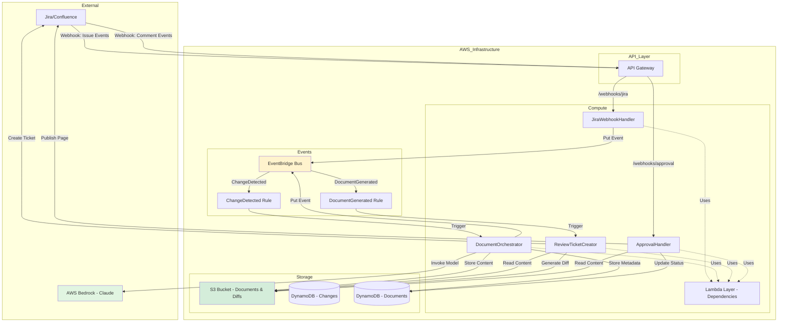
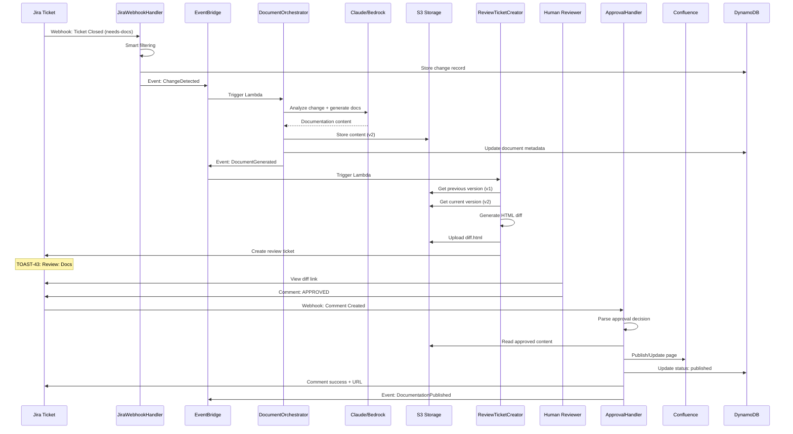
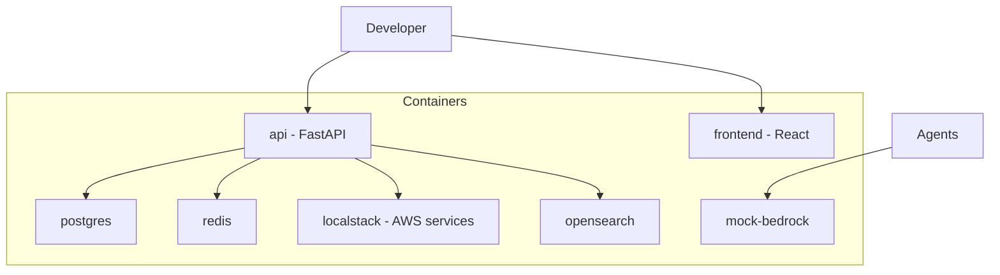

# Architecture

Kinexus AI uses a **serverless event-driven architecture** on AWS to automatically generate, review, and publish documentation. The production system is fully deployed on AWS using Lambda functions, EventBridge, DynamoDB, S3, and API Gateway. A local FastAPI development stack is available for testing.

## Production Architecture (AWS Serverless)

### High-Level Components



### AWS Components

**Lambda Functions:**
1. **JiraWebhookHandler** (`src/lambdas/jira_webhook_handler.py`)
   - Processes Jira webhook events (ticket created, updated, closed)
   - Smart filtering to determine if documentation needed
   - Creates change records in DynamoDB
   - Emits `ChangeDetected` events to EventBridge
   - Timeout: 30s | Memory: 512MB

2. **DocumentOrchestrator** (`src/lambdas/document_orchestrator.py`)
   - Triggered by `ChangeDetected` events
   - Analyzes changes using Claude (AWS Bedrock)
   - Generates documentation content
   - Stores content in S3 with versioning
   - Updates document metadata in DynamoDB
   - Emits `DocumentGenerated` events
   - Timeout: 5min | Memory: 1024MB

3. **ReviewTicketCreator** (`src/lambdas/review_ticket_creator.py`)
   - Triggered by `DocumentGenerated` events
   - Retrieves previous and current versions from S3
   - Generates HTML visual diffs (red/green highlighting)
   - Detects image changes (added/removed)
   - Uploads diff to S3 with presigned URL
   - Auto-creates Jira review ticket with diff link
   - Timeout: 60s | Memory: 512MB

4. **ApprovalHandler** (`src/lambdas/approval_handler.py`)
   - Processes Jira comment webhooks
   - Pattern matches approval commands (APPROVED/REJECTED/NEEDS REVISION)
   - Publishes approved docs to Confluence
   - Updates DynamoDB and Jira tickets
   - Emits `DocumentationPublished` events
   - Timeout: 90s | Memory: 512MB

**EventBridge:**
- **Event Bus**: `kinexus-events`
- **Rules:**
  - `ChangeDetectedRule`: Routes `kinexus.jira/ChangeDetected` → DocumentOrchestrator
  - `DocumentGeneratedRule`: Routes `kinexus.orchestrator/DocumentGenerated` → ReviewTicketCreator

**DynamoDB Tables:**
- **kinexus-changes**: Stores change records from Jira tickets
  - Partition key: `change_id`
  - Tracks: ticket_key, summary, status, labels, documentation context
- **kinexus-documents**: Stores document metadata and versions
  - Partition key: `document_id`
  - Tracks: title, content location (S3), version, approval status, review tickets

**S3 Bucket:**
- **kinexus-documents-{account}-{region}**
  - `documents/` - Generated documentation content (markdown)
  - `diffs/` - HTML visual diffs with presigned URLs (7-day expiry)
  - Versioning enabled for audit trail

**API Gateway:**
- **Endpoints:**
  - `POST /webhooks/jira` → JiraWebhookHandler
  - `POST /webhooks/approval` → ApprovalHandler
  - `GET /documents` → DocumentOrchestrator (query)

**Lambda Layer:**
- Shared dependencies: structlog, httpx, anthropic, pydantic, requests, orjson
- Excludes boto3/botocore (provided by AWS runtime)
- Size: ~30MB compressed

### Production Workflow



## Local Development Topology (FastAPI Stack)

For **local development and testing**, Kinexus provides a containerized FastAPI stack:



- `./quick-start.sh dev` orchestrates the stack, generates Poetry lock files, builds Docker images, and launches all containerized services
- `mock-bedrock` offers deterministic responses for integration tests; switch to live Bedrock by setting `BEDROCK_ENDPOINT_URL` and credentials
- LocalStack keeps S3, DynamoDB, and EventBridge APIs available for the agent scripts that expect AWS resources
- **Note:** The local stack is for development only. Production uses AWS Lambda.

## Infrastructure as Code

Kinexus uses **AWS CDK (Python)** for infrastructure:

```python
# infrastructure/app.py
class KinexusAIMVPStack(Stack):
    - Lambda functions (5 total)
    - Lambda layer (shared dependencies)
    - EventBridge bus and rules
    - DynamoDB tables (2)
    - S3 bucket (versioned)
    - API Gateway REST API
    - IAM roles and permissions

# Deployment
cdk deploy --context environment=development \
  --context jira_base_url=$JIRA_BASE_URL \
  --context jira_api_token=$JIRA_API_TOKEN
```

**GitHub Actions CI/CD:**
- `.github/workflows/dev.yaml`
- Triggers: Push to `develop` branch
- Steps:
  1. Run tests (pytest, black, isort, ruff)
  2. Build Lambda layer (`scripts/build-layer.sh`)
  3. Deploy CDK stack with secrets from GitHub
  4. Verify deployment

## Event Patterns

**ChangeDetected Event:**
```json
{
  "source": "kinexus.jira",
  "detail-type": "ChangeDetected",
  "detail": {
    "change_id": "jira_TOAST-42_...",
    "ticket_key": "TOAST-42",
    "summary": "Add OAuth2 authentication",
    "documentation_context": {...}
  }
}
```

**DocumentGenerated Event:**
```json
{
  "source": "kinexus.orchestrator",
  "detail-type": "DocumentGenerated",
  "detail": {
    "document_id": "doc_api-auth_v3",
    "title": "API Authentication Guide",
    "version": 3,
    "s3_location": "s3://kinexus-documents-.../documents/..."
  }
}
```

**DocumentationPublished Event:**
```json
{
  "source": "kinexus.approval",
  "detail-type": "DocumentationPublished",
  "detail": {
    "document_id": "doc_api-auth_v3",
    "confluence_url": "https://.../wiki/spaces/SD/pages/98310",
    "approved_by": "sarah.techwriter",
    "approved_at": "2025-10-19T20:45:00Z"
  }
}
```

## Security & Permissions

**Lambda IAM Roles:**
- Bedrock: `bedrock:InvokeModel`, `bedrock:InvokeModelWithResponseStream`
- DynamoDB: Read/write on `kinexus-changes`, `kinexus-documents`
- S3: Read/write on `kinexus-documents-*` bucket
- EventBridge: `events:PutEvents` on `kinexus-events` bus
- CloudWatch Logs: Write logs (1-week retention)

**Secrets Management:**
- Jira/Confluence credentials passed via CDK context from GitHub Secrets
- Environment variables on Lambda functions
- **Production**: Should migrate to AWS Secrets Manager

## Planned Enhancements

- **Automated Image Generation**: AI-generated diagrams using Mermaid/PlantUML
- **Multi-Stage Approval**: Technical review → Documentation review → Product approval
- **Slack Integration**: Notifications and inline approval buttons
- **Metrics Dashboard**: Approval times, rejection rates, quality scores
- **Revision Workflow**: Track changes after "NEEDS REVISION" feedback
- **Enhanced RAG**: Use OpenSearch for context retrieval before generation
- **Integration Hardening**: GitHub, ServiceNow, SharePoint adapters
