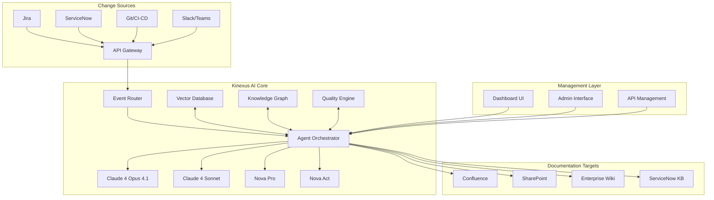
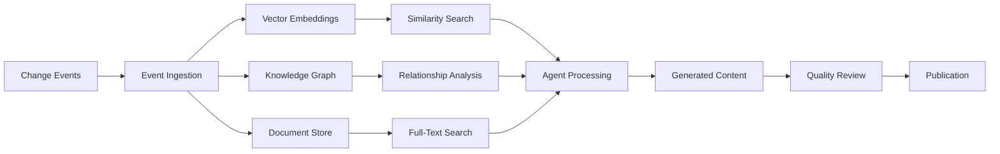
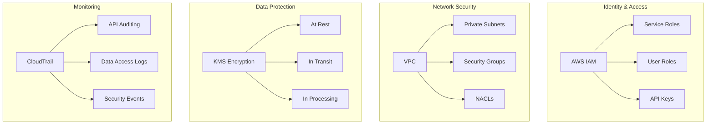

# Kinexus AI: System Architecture

## Table of Contents
- [Executive Summary](#executive-summary)
- [Core Architecture Overview](#core-architecture-overview)
- [AI Models & Services](#ai-models--services)
- [Agent Framework](#agent-framework)
- [Data Architecture](#data-architecture)
- [Integration Layer](#integration-layer)
- [Security Architecture](#security-architecture)
- [Scalability & Performance](#scalability--performance)
- [Deployment Architecture](#deployment-architecture)

## Executive Summary

Kinexus AI leverages Amazon Web Services' latest AI capabilities to create an autonomous knowledge management system. Built on AWS Bedrock with Claude 4 and Nova models, the system provides enterprise-grade documentation lifecycle management through intelligent agents that detect changes, analyze impact, generate content, and maintain quality standards.

### Key Architectural Principles
- **Cloud-Native**: Built for AWS with serverless-first approach
- **Agent-Driven**: Autonomous operation through specialized AI agents
- **Event-Driven**: Real-time processing with asynchronous workflows
- **Microservices**: Loosely coupled, independently scalable components
- **Security-First**: Zero-trust architecture with comprehensive audit trails

## Core Architecture Overview



## AI Models & Services

### Primary Models (September 2025)

#### Claude 4 Opus 4.1
- **Role**: Master reasoning engine and decision orchestrator
- **Capabilities**: 
  - Complex reasoning with 74.5% SWE-bench performance
  - Hybrid reasoning (instant + extended thinking modes)
  - 1M token context window for comprehensive analysis
- **Use Cases**:
  - Strategic documentation decisions
  - Cross-system impact analysis
  - Quality assessment and approval workflows
  - Complex technical content generation

#### Claude 4 Sonnet
- **Role**: High-speed multimodal processing engine
- **Capabilities**:
  - 1M token context window
  - Multimodal input processing (text, images, code)
  - Fast response times for real-time operations
- **Use Cases**:
  - Real-time change analysis
  - Content generation and updates
  - Image and diagram processing
  - Code documentation generation

#### Amazon Nova Pro
- **Role**: Advanced multimodal understanding
- **Capabilities**:
  - Video, image, and text analysis
  - Best accuracy/speed/cost ratio
  - Multimodal content creation
- **Use Cases**:
  - Video tutorial analysis
  - Diagram interpretation
  - Screenshots and UI documentation
  - Training material processing

#### Amazon Nova Act
- **Role**: Agentic browser automation
- **Capabilities**:
  - Web browser control and automation
  - Form submissions and UI interactions
  - Legacy system integration
- **Use Cases**:
  - Automated documentation publishing
  - Legacy system updates
  - UI testing and validation
  - Web-based workflow automation

#### Amazon Nova Canvas
- **Role**: Visual content generation
- **Capabilities**:
  - State-of-the-art image generation
  - Technical diagram creation
  - Visual documentation assets
- **Use Cases**:
  - Architecture diagrams
  - Process flowcharts
  - Infographics and visual aids
  - Documentation illustrations

#### Amazon Nova Sonic
- **Role**: Speech interface and accessibility
- **Capabilities**:
  - Speech understanding and generation
  - Human-like voice conversations
  - Accessibility features
- **Use Cases**:
  - Voice-driven documentation
  - Accessibility compliance
  - Audio documentation reviews
  - Voice notifications and alerts

### Model Selection Strategy

```python
class ModelSelector:
    def select_model(self, task_type, complexity, latency_req):
        if task_type == "strategic_decision":
            return "claude-4-opus-4.1"
        elif task_type == "multimodal_analysis":
            return "nova-pro"
        elif task_type == "web_automation":
            return "nova-act"
        elif latency_req == "ultra_low":
            return "nova-micro"
        else:
            return "claude-4-sonnet"
```

## Agent Framework

### Core Agents Architecture

#### 1. Master Documentation Agent
```yaml
Agent: DocumentationOrchestrator
Model: Claude 4 Opus 4.1
Responsibilities:
  - Strategic decision making
  - Cross-system coordination
  - Quality oversight
  - Approval workflows
Tools:
  - Vector database access
  - Knowledge graph queries
  - Quality metrics API
  - Notification system
```

#### 2. Change Detection Agent
```yaml
Agent: ChangeAnalyzer
Model: Claude 4 Sonnet + Nova Pro
Responsibilities:
  - Real-time change monitoring
  - Impact assessment
  - Change classification
  - Urgency prioritization
Tools:
  - Git API connectors
  - CI/CD webhooks
  - Issue tracking APIs
  - Communication platform APIs
```

#### 3. Content Generation Agent
```yaml
Agent: ContentCreator
Model: Claude 4 Sonnet + Nova Canvas
Responsibilities:
  - Technical content writing
  - Documentation updates
  - Visual asset creation
  - Multi-format generation
Tools:
  - Template engines
  - Style guides
  - Content validators
  - Image generation APIs
```

#### 4. Web Automation Agent
```yaml
Agent: WebAutomator
Model: Nova Act
Responsibilities:
  - Browser-based publishing
  - Legacy system integration
  - Form submissions
  - UI testing
Tools:
  - Web browser control
  - Form automation
  - Screenshot capture
  - Link validation
```

#### 5. Quality Assurance Agent
```yaml
Agent: QualityController
Model: Nova Pro + Claude 4 Sonnet
Responsibilities:
  - Content quality validation
  - Compliance checking
  - Accessibility assessment
  - Performance monitoring
Tools:
  - Quality metrics engine
  - Compliance checkers
  - Accessibility scanners
  - Performance analyzers
```

### Agent Communication Protocol

```python
class AgentCommunication:
    def __init__(self):
        self.event_bus = EventBridge()
        self.shared_context = DynamoDB()
        self.message_queue = SQS()
    
    def publish_event(self, event_type, data, target_agents):
        """Publish events to specific agents"""
        event = {
            'type': event_type,
            'data': data,
            'timestamp': datetime.utcnow(),
            'source_agent': self.agent_id,
            'target_agents': target_agents
        }
        self.event_bus.put_events(Entries=[event])
    
    def subscribe_to_events(self, event_types, callback):
        """Subscribe to specific event types"""
        for event_type in event_types:
            self.event_bus.create_rule(
                EventPattern={'source': [event_type]},
                Targets=[{'Arn': callback}]
            )
```

## Data Architecture

### Data Flow Diagram



### Data Stores

#### Vector Database (Amazon OpenSearch)
```json
{
  "purpose": "Semantic search and similarity matching",
  "data_types": [
    "Document embeddings",
    "Code embeddings", 
    "Change embeddings",
    "User query embeddings"
  ],
  "indexes": {
    "documents": "768-dimensional vectors",
    "code_changes": "1536-dimensional vectors",
    "user_queries": "768-dimensional vectors"
  }
}
```

#### Knowledge Graph (Amazon Neptune)
```cypher
// Example knowledge graph structure
(System)-[:CONTAINS]->(Component)
(Component)-[:DOCUMENTED_BY]->(Document)
(Document)-[:REFERENCES]->(Document)
(Change)-[:AFFECTS]->(Component)
(User)-[:OWNS]->(Document)
(Team)-[:RESPONSIBLE_FOR]->(System)
```

#### Document Store (Amazon S3 + DynamoDB)
```yaml
S3_Structure:
  raw_documents/
    - Original documentation files
    - Generated content drafts
    - Media assets and diagrams
  processed_documents/
    - Vectorized content
    - Enriched metadata
    - Version history

DynamoDB_Tables:
  DocumentMetadata:
    - Document ID, version, status
    - Author, reviewers, timestamps
    - Quality scores, compliance flags
  ChangeTracking:
    - Change ID, source, timestamp
    - Impact assessment, priority
    - Processing status, agents assigned
```

### Data Processing Pipeline

```python
class DataPipeline:
    def __init__(self):
        self.embedding_model = BedrockEmbeddings("titan-embed-text-v1")
        self.vector_store = OpenSearchVectorSearch()
        self.knowledge_graph = Neptune()
    
    async def process_change_event(self, event):
        # Extract and enrich event data
        enriched_data = await self.enrich_event(event)
        
        # Generate embeddings
        embedding = await self.embedding_model.embed_documents([enriched_data])
        
        # Store in vector database
        await self.vector_store.add_documents([enriched_data], embeddings=embedding)
        
        # Update knowledge graph
        await self.knowledge_graph.add_relationships(enriched_data.relationships)
        
        # Trigger agent processing
        await self.trigger_agents(enriched_data)
```

## Integration Layer

### Source System Connectors

#### Jira Integration
```python
class JiraConnector:
    def __init__(self, base_url, auth_token):
        self.client = JiraClient(base_url, auth_token)
        self.webhook_handler = WebhookHandler()
    
    def setup_webhooks(self):
        """Setup real-time webhooks for issue changes"""
        webhook_config = {
            'url': f'{KINEXUS_URL}/webhooks/jira',
            'events': ['issue_updated', 'issue_created', 'issue_deleted'],
            'filters': {'projects': ['*']}
        }
        return self.client.create_webhook(webhook_config)
    
    async def process_issue_change(self, webhook_data):
        """Process Jira issue changes"""
        change_event = {
            'source': 'jira',
            'type': 'issue_change',
            'data': {
                'issue_key': webhook_data['issue']['key'],
                'change_type': webhook_data['webhookEvent'],
                'fields_changed': webhook_data.get('changelog', {}).get('items', []),
                'timestamp': webhook_data['timestamp']
            }
        }
        await self.event_publisher.publish(change_event)
```

#### Git Integration
```python
class GitConnector:
    def __init__(self, providers=['github', 'gitlab', 'bitbucket']):
        self.providers = {
            provider: GitProvider(provider) for provider in providers
        }
    
    async def monitor_repositories(self, repo_list):
        """Monitor multiple repositories for changes"""
        for repo in repo_list:
            webhook_url = f'{KINEXUS_URL}/webhooks/git/{repo.provider}'
            await repo.setup_webhook(webhook_url, ['push', 'pull_request'])
    
    async def process_commit(self, commit_data):
        """Process code commits for documentation impact"""
        files_changed = commit_data['modified'] + commit_data['added']
        
        # Analyze code changes for documentation impact
        impact_analysis = await self.analyze_code_impact(files_changed)
        
        change_event = {
            'source': 'git',
            'type': 'code_change',
            'data': {
                'commit_hash': commit_data['id'],
                'repository': commit_data['repository'],
                'files_changed': files_changed,
                'impact_analysis': impact_analysis,
                'timestamp': commit_data['timestamp']
            }
        }
        await self.event_publisher.publish(change_event)
```

### Target System Connectors

#### Confluence Integration
```python
class ConfluenceConnector:
    def __init__(self, base_url, auth_token):
        self.client = ConfluenceClient(base_url, auth_token)
        self.content_manager = ContentManager()
    
    async def publish_content(self, content_data):
        """Publish or update Confluence pages"""
        if content_data.get('page_id'):
            # Update existing page
            return await self.client.update_page(
                page_id=content_data['page_id'],
                title=content_data['title'],
                content=content_data['body'],
                version=content_data['version'] + 1
            )
        else:
            # Create new page
            return await self.client.create_page(
                space_key=content_data['space'],
                title=content_data['title'],
                content=content_data['body'],
                parent_id=content_data.get('parent_id')
            )
    
    async def validate_links(self, page_id):
        """Validate all links in a page"""
        page_content = await self.client.get_page_content(page_id)
        links = self.extract_links(page_content)
        
        validation_results = []
        for link in links:
            is_valid = await self.validate_link(link)
            validation_results.append({
                'url': link,
                'valid': is_valid,
                'checked_at': datetime.utcnow()
            })
        
        return validation_results
```

## Security Architecture

### Zero-Trust Security Model



### Security Components

#### Authentication & Authorization
```python
class SecurityManager:
    def __init__(self):
        self.iam_client = boto3.client('iam')
        self.cognito_client = boto3.client('cognito-idp')
        self.secrets_manager = boto3.client('secretsmanager')
    
    def create_service_role(self, service_name, permissions):
        """Create IAM role for Kinexus services"""
        trust_policy = {
            "Version": "2012-10-17",
            "Statement": [{
                "Effect": "Allow",
                "Principal": {"Service": "lambda.amazonaws.com"},
                "Action": "sts:AssumeRole"
            }]
        }
        
        role_response = self.iam_client.create_role(
            RoleName=f'KinexusAI-{service_name}-Role',
            AssumeRolePolicyDocument=json.dumps(trust_policy)
        )
        
        # Attach minimal required permissions
        for permission in permissions:
            self.iam_client.attach_role_policy(
                RoleName=role_response['Role']['RoleName'],
                PolicyArn=permission
            )
        
        return role_response['Role']['Arn']
```

#### Data Encryption
```python
class EncryptionManager:
    def __init__(self):
        self.kms_client = boto3.client('kms')
        self.key_id = self.create_kinexus_key()
    
    def create_kinexus_key(self):
        """Create dedicated KMS key for Kinexus AI"""
        key_policy = {
            "Version": "2012-10-17",
            "Statement": [{
                "Effect": "Allow",
                "Principal": {"AWS": f"arn:aws:iam::{ACCOUNT_ID}:root"},
                "Action": "kms:*",
                "Resource": "*"
            }]
        }
        
        response = self.kms_client.create_key(
            Policy=json.dumps(key_policy),
            Description="Kinexus AI Encryption Key",
            Usage="ENCRYPT_DECRYPT"
        )
        
        return response['KeyMetadata']['KeyId']
    
    def encrypt_sensitive_data(self, data):
        """Encrypt sensitive data using KMS"""
        response = self.kms_client.encrypt(
            KeyId=self.key_id,
            Plaintext=json.dumps(data)
        )
        return base64.b64encode(response['CiphertextBlob']).decode()
```

## Scalability & Performance

### Auto-Scaling Configuration

#### Lambda Functions
```yaml
Lambda_Configuration:
  Memory: 1024MB - 10240MB (auto-scaling based on load)
  Timeout: 15 minutes maximum
  Concurrency: 
    Reserved: 100 (critical functions)
    Provisioned: 50 (warm starts)
  Environment:
    Variables:
      - PYTHONPATH: /opt/python
      - LOG_LEVEL: INFO
      - KMS_KEY_ID: ${KMS_KEY_ID}
```

#### DynamoDB Auto-Scaling
```python
class DynamoDBAutoScaling:
    def setup_auto_scaling(self, table_name):
        """Configure auto-scaling for DynamoDB tables"""
        autoscaling_client = boto3.client('application-autoscaling')
        
        # Register scalable target
        autoscaling_client.register_scalable_target(
            ServiceNamespace='dynamodb',
            ResourceId=f'table/{table_name}',
            ScalableDimension='dynamodb:table:ReadCapacityUnits',
            MinCapacity=5,
            MaxCapacity=40000
        )
        
        # Create scaling policy
        autoscaling_client.put_scaling_policy(
            PolicyName=f'{table_name}-read-scaling-policy',
            ServiceNamespace='dynamodb',
            ResourceId=f'table/{table_name}',
            ScalableDimension='dynamodb:table:ReadCapacityUnits',
            PolicyType='TargetTrackingScaling',
            TargetTrackingScalingPolicyConfiguration={
                'TargetValue': 70.0,
                'PredefinedMetricSpecification': {
                    'PredefinedMetricType': 'DynamoDBReadCapacityUtilization'
                }
            }
        )
```

### Performance Optimization

#### Caching Strategy
```python
class CachingLayer:
    def __init__(self):
        self.redis_client = redis.Redis(
            host=ELASTICACHE_ENDPOINT,
            port=6379,
            decode_responses=True
        )
        self.default_ttl = 3600  # 1 hour
    
    async def get_cached_embedding(self, content_hash):
        """Get cached embedding to avoid recomputation"""
        cache_key = f"embedding:{content_hash}"
        cached_embedding = self.redis_client.get(cache_key)
        
        if cached_embedding:
            return json.loads(cached_embedding)
        return None
    
    async def cache_embedding(self, content_hash, embedding):
        """Cache embedding for future use"""
        cache_key = f"embedding:{content_hash}"
        self.redis_client.setex(
            cache_key, 
            self.default_ttl,
            json.dumps(embedding)
        )
```

## Deployment Architecture

### Multi-Environment Strategy

```yaml
Environments:
  Development:
    - Single region (us-east-1)
    - Minimal compute resources
    - Shared databases
    - Basic monitoring
  
  Staging:
    - Single region (us-east-1)
    - Production-like setup
    - Separate databases
    - Full monitoring
    - Performance testing
  
  Production:
    - Multi-region (us-east-1, us-west-2)
    - High availability
    - Dedicated resources
    - Comprehensive monitoring
    - Disaster recovery
```

### Infrastructure as Code

```python
# CDK Stack for Kinexus AI
class KinexusAIStack(Stack):
    def __init__(self, scope: Construct, construct_id: str, **kwargs):
        super().__init__(scope, construct_id, **kwargs)
        
        # VPC and Networking
        self.vpc = ec2.Vpc(
            self, "KinexusVPC",
            max_azs=3,
            nat_gateways=2
        )
        
        # DynamoDB Tables
        self.documents_table = dynamodb.Table(
            self, "DocumentsTable",
            partition_key=dynamodb.Attribute(
                name="document_id",
                type=dynamodb.AttributeType.STRING
            ),
            billing_mode=dynamodb.BillingMode.ON_DEMAND,
            encryption=dynamodb.TableEncryption.AWS_MANAGED
        )
        
        # Lambda Functions
        self.create_agent_functions()
        
        # API Gateway
        self.api = apigateway.RestApi(
            self, "KinexusAPI",
            rest_api_name="Kinexus AI API",
            description="API for Kinexus AI system"
        )
        
        # EventBridge Rules
        self.setup_event_routing()
    
    def create_agent_functions(self):
        """Create Lambda functions for each agent"""
        agents = [
            'document-orchestrator',
            'change-analyzer', 
            'content-creator',
            'web-automator',
            'quality-controller'
        ]
        
        for agent in agents:
            lambda_function = aws_lambda.Function(
                self, f"{agent.title()}Function",
                runtime=aws_lambda.Runtime.PYTHON_3_11,
                handler=f"agents.{agent.replace('-', '_')}.handler",
                code=aws_lambda.Code.from_asset("src"),
                environment={
                    "DOCUMENTS_TABLE": self.documents_table.table_name,
                    "REGION": self.region
                },
                timeout=Duration.minutes(15),
                memory_size=2048
            )
            
            # Grant permissions
            self.documents_table.grant_read_write_data(lambda_function)
```

This comprehensive system architecture provides the foundation for building Kinexus AI as a production-ready, enterprise-grade solution that showcases the latest AWS AI capabilities while solving real business problems.