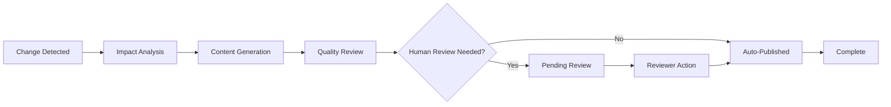

# Kinexus AI: User Guide

## Table of Contents
- [Getting Started](#getting-started)
- [Dashboard Overview](#dashboard-overview)
- [Managing Changes](#managing-changes)
- [Working with Documents](#working-with-documents)
- [Quality & Compliance](#quality--compliance)
- [Integrations](#integrations)
- [Notifications & Reviews](#notifications--reviews)
- [Advanced Features](#advanced-features)
- [Troubleshooting](#troubleshooting)

## Getting Started

Welcome to Kinexus AI! This guide will help you understand how to use the system to keep your documentation automatically synchronized with system changes.

### First Login

1. **Access the Dashboard**
   - Navigate to your Kinexus AI URL (provided by your administrator)
   - Log in using your enterprise credentials (SSO supported)

2. **Complete Initial Setup**
   - Review your profile settings
   - Set notification preferences
   - Connect your first integration (optional)

3. **Take the Tour**
   - Click the "Take Tour" button to see key features
   - Review sample documentation and changes

### Dashboard Navigation

```
┌─ Header ─────────────────────────────────────────────┐
│ [Logo] Kinexus AI    [Search] [Notifications] [User] │
├─ Sidebar ─┬─ Main Content ─────────────────────────┤
│ Dashboard  │ Welcome to Kinexus AI                  │
│ Changes    │ ┌─ Quick Stats ─┐ ┌─ Recent Activity ─┐│
│ Documents  │ │ 45 Documents  │ │ 3 Changes Today  ││
│ Quality    │ │ 98% Quality   │ │ 2 Reviews Needed ││
│ Teams      │ │ 12 Active     │ │ 1 Issue Fixed    ││
│ Settings   │ └───────────────┘ └──────────────────┘│
└────────────┴─────────────────────────────────────────┘
```

## Dashboard Overview

### Quick Stats Widget
- **Total Documents**: All documents under Kinexus AI management
- **Quality Score**: Average quality across all documentation
- **Active Changes**: Currently processing change events
- **Team Activity**: Recent team member actions

### Recent Activity Feed
Real-time updates of system activity:
- 🔄 Change events received
- 📝 Documents updated
- ✅ Reviews completed
- ⚠️ Quality alerts
- 🔗 New integrations

### Smart Recommendations
AI-powered suggestions based on your activity:
- Documents needing attention
- Integrations to configure
- Quality improvements to make
- Team members to notify

## Managing Changes

### Understanding Change Events

Kinexus AI automatically detects changes from connected systems and determines their documentation impact.

#### Change Types
- **Code Changes**: Git commits, pull requests, deployments
- **Project Updates**: Jira tickets, project milestones
- **Infrastructure Changes**: Server deployments, configuration updates
- **Process Changes**: Team decisions, policy updates

### Viewing Changes

1. **Access Changes Page**
   - Click "Changes" in the sidebar
   - View real-time change feed

2. **Change Details**
   ```
   ┌─ Change Event ──────────────────────────────────┐
   │ 🔄 API Endpoint Update                          │
   │ Source: GitHub • Type: Code Change              │
   │ Impact: 3 documents • Priority: Medium          │
   │                                                 │
   │ Details:                                        │
   │ • Repository: payment-service                   │
   │ • Files: src/auth.py, docs/api.md              │
   │ • Commit: abc123... "Add OAuth2 support"       │
   │                                                 │
   │ [View Full Details] [Track Progress]           │
   └─────────────────────────────────────────────────┘
   ```

3. **Filter Changes**
   - By source system (Jira, Git, Slack)
   - By status (Processing, Completed, Needs Review)
   - By priority (High, Medium, Low)
   - By date range

### Change Processing Workflow



#### Processing Status Indicators
- 🔄 **Processing**: AI agents are working on the change
- 👀 **Needs Review**: Human review required before publishing
- ✅ **Completed**: Change processed and documentation updated
- ⚠️ **Issues**: Problems encountered during processing
- ⏸️ **Paused**: Processing paused pending user input

## Working with Documents

### Document Library

Access all managed documents through the Documents page:

1. **Document List View**
   ```
   ┌─ Documents ──────────────────────────────────────┐
   │ [Search...] [Filter ▼] [Sort ▼] [New Document]  │
   │                                                  │
   │ 📄 API Integration Guide               Quality 95│
   │    Updated 2 hours ago • 2,456 words           │
   │    Tags: api, integration, developer             │
   │                                                  │
   │ 📄 Deployment Runbook                 Quality 87│
   │    Updated yesterday • 1,823 words              │
   │    Tags: operations, deployment                  │
   │                                                  │
   │ 📄 Security Policies                  Quality 92│
   │    Updated 3 days ago • 3,102 words             │
   │    Tags: security, compliance                    │
   └──────────────────────────────────────────────────┘
   ```

2. **Document Filters**
   - **Status**: Active, Draft, Archived, Needs Review
   - **Type**: API Docs, Runbooks, Guides, Policies
   - **Quality Score**: Above/below thresholds
   - **Last Updated**: Time ranges
   - **Team**: Filter by responsible team
   - **Tags**: Filter by content tags

### Document Details

Click any document to view detailed information:

#### Document Header
- Title and description
- Quality score and breakdown
- Last updated timestamp
- Responsible team/author
- Tags and categories

#### Content Tabs
- **Content**: Full document content
- **History**: Change history and versions
- **Quality**: Quality metrics and compliance status
- **Relations**: Related documents and dependencies
- **Reviews**: Review history and pending approvals

#### Quality Metrics Breakdown
```
┌─ Quality Breakdown ─────────────────────────────────┐
│ Overall Score: 92/100                               │
│                                                     │
│ Accuracy     ████████████████████ 95/100          │
│ Completeness █████████████████    87/100          │
│ Readability  ██████████████████   91/100          │
│ Freshness    ████████████████████ 98/100          │
│ Compliance   ██████████████████   94/100          │
│                                                     │
│ Recommendations:                                    │
│ • Add code examples to increase completeness        │
│ • Update contact information in footer              │
│ • Consider adding troubleshooting section           │
└─────────────────────────────────────────────────────┘
```

### Creating Documents

1. **Manual Document Creation**
   - Click "New Document" button
   - Choose document type and template
   - Add content using rich text editor
   - Set metadata (tags, team, etc.)
   - Save as draft or publish

2. **AI-Assisted Creation**
   - Describe what documentation you need
   - Select source materials (code, tickets, etc.)
   - Review AI-generated outline
   - Collaborate with AI to refine content
   - Review and publish

### Document Collaboration

#### Review Workflow
1. Documents requiring review appear in your notifications
2. Access review from notification or document page
3. Review changes line-by-line
4. Add comments and suggestions
5. Approve, request changes, or reject

#### Comment System
- Add inline comments on specific sections
- Reply to existing comments
- Resolve comments when addressed
- @mention team members for notifications

## Quality & Compliance

### Quality Dashboard

Monitor documentation quality across your organization:

#### Quality Overview
- **Overall Quality Score**: Organization-wide average
- **Quality Trends**: Score changes over time
- **Quality Distribution**: Documents by score range
- **Compliance Status**: Regulatory compliance metrics

#### Quality Alerts
```
┌─ Quality Alerts ────────────────────────────────────┐
│ ⚠️ 5 documents below quality threshold              │
│ 📊 Quality score dropped 3% this week              │
│ 🔍 12 documents need accessibility review           │
│ 📅 8 documents haven't been updated in 90 days     │
└─────────────────────────────────────────────────────┘
```

### Compliance Management

#### Compliance Rules
- **Accessibility**: WCAG 2.1 AA compliance
- **Security**: Security review requirements
- **Style Guide**: Organizational style standards
- **Retention**: Document retention policies

#### Compliance Dashboard
- View compliance status by category
- See failed compliance checks
- Track remediation progress
- Generate compliance reports

### Quality Improvement

#### Automated Improvements
Kinexus AI automatically suggests and implements quality improvements:
- Grammar and spelling corrections
- Consistency improvements
- Link validation and updates
- Formatting standardization

#### Manual Quality Actions
- Request focused quality review
- Update outdated content
- Improve accessibility
- Add missing sections

## Integrations

### Supported Integrations

#### Change Sources
- **Jira**: Project management and issue tracking
- **GitHub/GitLab/Bitbucket**: Code repositories
- **Slack/Microsoft Teams**: Team communications
- **ServiceNow**: IT service management
- **Jenkins/CircleCI**: CI/CD pipelines

#### Documentation Targets
- **Confluence**: Team wikis and knowledge bases
- **SharePoint**: Enterprise document management
- **Notion**: Team documentation platforms
- **Google Drive**: Cloud document storage
- **Custom APIs**: Proprietary documentation systems

### Setting Up Integrations

1. **Access Integrations Page**
   - Navigate to Settings > Integrations
   - View available and configured integrations

2. **Configure New Integration**
   - Click "Add Integration" button
   - Select integration type
   - Follow setup wizard
   - Test connection
   - Configure sync settings

3. **Integration Configuration Example (Jira)**
   ```
   ┌─ Jira Integration Setup ────────────────────────────┐
   │ Server URL: https://company.atlassian.net          │
   │ Authentication: [Personal Access Token]            │
   │                                                     │
   │ Projects to Monitor:                                │
   │ ☑️ PROJ - Main Project                             │
   │ ☑️ DEV - Development Team                          │
   │ ☐ ADMIN - Administrative                           │
   │                                                     │
   │ Events to Track:                                    │
   │ ☑️ Issue Created      ☑️ Issue Updated             │
   │ ☑️ Issue Resolved     ☐ Issue Deleted              │
   │                                                     │
   │ Documentation Impact:                               │
   │ ☑️ Auto-create docs for new features               │
   │ ☑️ Update docs when issues resolved                │
   │ ☑️ Archive docs for deprecated features            │
   │                                                     │
   │ [Test Connection] [Save Configuration]             │
   └─────────────────────────────────────────────────────┘
   ```

### Managing Integrations

#### Integration Status
- **Active**: Integration is working normally
- **Warning**: Minor issues detected
- **Error**: Integration not functioning
- **Disabled**: Integration manually disabled

#### Integration Metrics
- Events received per day
- Processing success rate
- Average processing time
- Last successful sync

## Notifications & Reviews

### Notification System

Stay informed about important events and required actions:

#### Notification Types
- 🔔 **Review Required**: Documents needing your review
- 📝 **Document Updated**: Documents you follow were updated
- ⚠️ **Quality Alert**: Quality issues detected
- 🚀 **Change Completed**: Changes you submitted are complete
- 👥 **Team Mention**: You were mentioned in comments

#### Notification Preferences
```
┌─ Notification Settings ─────────────────────────────┐
│ Email Notifications:                                │
│ ☑️ Immediate for urgent items                       │
│ ☑️ Daily digest for routine updates                 │
│ ☐ Weekly summary report                             │
│                                                     │
│ In-App Notifications:                               │
│ ☑️ Real-time notifications                          │
│ ☑️ Browser notifications                            │
│                                                     │
│ Notification Categories:                            │
│ ☑️ Reviews required        ☑️ Quality alerts        │
│ ☑️ Document updates        ☐ System announcements  │
│ ☑️ Team mentions          ☑️ Integration issues     │
│                                                     │
│ [Save Preferences]                                  │
└─────────────────────────────────────────────────────┘
```

### Review Process

#### Receiving Review Requests
1. Notification appears in dashboard
2. Email notification sent (if enabled)
3. Review item appears in "My Reviews" section

#### Conducting Reviews
1. **Access Review**
   - Click notification or review item
   - View document with changes highlighted

2. **Review Interface**
   ```
   ┌─ Document Review ───────────────────────────────────┐
   │ API Authentication Guide                            │
   │ Changes by: Kinexus AI • Triggered by: PROJ-1234   │
   │                                                     │
   │ ## OAuth 2.0 Support                               │
   │ + The API now supports OAuth 2.0 authentication    │
   │ + in addition to the existing API key method.      │
   │                                                     │
   │ ### Configuration                                   │
   │ - To use OAuth 2.0, register your application...   │
   │ + To use OAuth 2.0, follow these steps:            │
   │ + 1. Register your application in the developer... │
   │                                                     │
   │ [💬 Add Comment] [✅ Approve] [❌ Reject] [⚠️ Request Changes] │
   └─────────────────────────────────────────────────────┘
   ```

3. **Review Actions**
   - **Approve**: Accept changes and publish
   - **Request Changes**: Request modifications before approval
   - **Reject**: Reject changes entirely
   - **Add Comments**: Provide feedback without decision

#### Review Comments
- Add line-specific comments
- Suggest specific changes
- Ask questions about content
- @mention other reviewers

## Advanced Features

### Search & Discovery

#### Global Search
- Search across all documents and content
- AI-powered semantic search
- Filter results by type, team, quality
- Save searches for quick access

#### Smart Suggestions
- Documents related to your current work
- Content that might be outdated
- Missing documentation opportunities
- Quality improvement suggestions

### Analytics & Insights

#### Documentation Analytics
- Most viewed documents
- Content engagement metrics
- Search query analysis
- User behavior insights

#### Team Performance
- Documentation coverage by team
- Response time to changes
- Quality trends by team
- Collaboration metrics

### Automation Rules

Create custom rules to automate common tasks:

#### Rule Examples
```yaml
# Auto-approve low-risk changes
Rule: Auto-approve documentation updates
Trigger: Document update from trusted source
Conditions:
  - Quality score > 90
  - No security content
  - Minor changes only
Action: Auto-approve and publish

# Alert for stale documentation
Rule: Stale documentation alert
Trigger: Daily schedule
Conditions:
  - Document not updated in 90 days
  - Document marked as "critical"
Action: Send alert to document owner
```

### API Integration

For advanced users and developers:

#### Personal API Keys
- Generate API keys for automation
- Set permissions and expiration
- Monitor API usage
- Revoke keys when needed

#### Webhook Configuration
- Receive notifications via webhooks
- Integrate with external systems
- Custom event handling
- Retry and error handling

## Troubleshooting

### Common Issues

#### "Document Not Updating"
**Symptoms**: Changes detected but documents not updating
**Solutions**:
1. Check integration connection status
2. Verify document permissions
3. Review automation rules
4. Check if document is locked for editing

#### "Review Notifications Not Received"
**Symptoms**: Missing review notifications
**Solutions**:
1. Check notification preferences
2. Verify email address in profile
3. Check spam/junk folder
4. Test notification system

#### "Quality Score Concerns"
**Symptoms**: Unexpectedly low quality scores
**Solutions**:
1. Review quality criteria
2. Check for compliance issues
3. Update content as suggested
4. Request manual quality review

#### "Integration Errors"
**Symptoms**: Integration showing error status
**Solutions**:
1. Check authentication credentials
2. Verify API permissions
3. Test connection manually
4. Review integration logs

### Getting Help

#### Self-Service Resources
- **Help Center**: Comprehensive documentation and FAQs
- **Video Tutorials**: Step-by-step guides for common tasks
- **Community Forum**: User community and discussions
- **Status Page**: System status and maintenance updates

#### Support Channels
- **In-App Help**: Click help icon for contextual assistance
- **Email Support**: support@kinexusai.com
- **Live Chat**: Available during business hours
- **Phone Support**: Enterprise customers only

#### Feedback and Suggestions
- **Feature Requests**: Submit via feedback form
- **Bug Reports**: Use bug report template
- **User Research**: Participate in user research studies
- **Beta Testing**: Join beta program for early access

### System Status Indicators

Monitor system health through status indicators:

- 🟢 **All Systems Operational**: Everything working normally
- 🟡 **Minor Issues**: Some features may be slow
- 🟠 **Major Issues**: Some features unavailable
- 🔴 **System Down**: Service temporarily unavailable

#### Performance Tips
- Use filters to reduce data loading
- Close unused browser tabs
- Clear browser cache if experiencing issues
- Use Chrome or Firefox for best performance

This user guide provides comprehensive coverage of Kinexus AI functionality, helping users at all levels make the most of the autonomous knowledge management system.