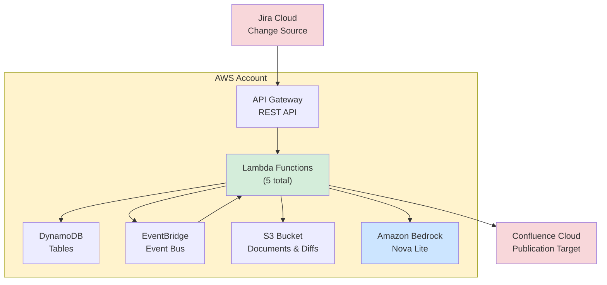

# Deployment Guide

Kinexus AI is designed for **AWS serverless deployment** using Lambda, EventBridge, DynamoDB, and S3. This is the **recommended production deployment method**. A Docker-based local development stack is also available for testing.

---

## 📋 Table of Contents

1. [Quick Start](#quick-start)
2. [AWS Deployment (Recommended)](#aws-deployment-recommended)
3. [Docker Deployment (Local Development)](#docker-deployment-local-development)
4. [Configuration](#configuration)
5. [Verification](#verification)
6. [Troubleshooting](#troubleshooting)

---

## 🚀 Quick Start

### Fork and Deploy (Easiest Method)

The fastest way to deploy Kinexus AI to your own AWS account using GitHub Actions:

**1. Fork this repository**
```bash
# Click "Fork" on GitHub or use gh CLI:
gh repo fork jaredgiosinuff/kinexus-ai --clone
cd kinexus-ai
```

**2. Set up GitHub Secrets**

Go to your forked repository → Settings → Secrets and variables → Actions → New repository secret

Add these secrets:

| Secret Name | Description | Example |
|------------|-------------|---------|
| `AWS_ACCESS_KEY_ID` | AWS IAM user access key | `AKIA...` |
| `AWS_SECRET_ACCESS_KEY` | AWS IAM user secret key | `wJalr...` |
| `AWS_ACCOUNT_ID` | Your AWS account ID | `123456789012` |
| `JIRA_BASE_URL` | Your Jira instance URL | `https://yourcompany.atlassian.net` |
| `JIRA_EMAIL` | Jira account email | `user@company.com` |
| `JIRA_API_TOKEN` | Jira API token ([create here](https://id.atlassian.com/manage-profile/security/api-tokens)) | `ATATT3x...` |
| `CONFLUENCE_URL` | Your Confluence URL | `https://yourcompany.atlassian.net/wiki` |

**3. Deploy automatically**
```bash
# Push to develop branch triggers deployment
git push origin develop

# Or manually trigger via GitHub Actions UI:
# Actions → "Deploy to AWS" → Run workflow
```

**4. Monitor deployment**

Watch the GitHub Actions workflow run. Deployment takes ~5-10 minutes.

**5. Configure Jira webhooks**

After deployment completes, configure webhooks using the API URLs from CloudFormation outputs:

```bash
# Set your Jira API token
export JIRA_API_TOKEN="your-token"

# Run webhook configuration scripts
./scripts/configure-jira-webhook.sh
./scripts/configure-approval-webhook.sh
```

**Done!** Your Kinexus AI instance is now live and ready to process Jira tickets.

---

## ☁️ AWS Deployment (Recommended)

### Prerequisites

**Required:**
- AWS Account with admin access or IAM permissions (see [aws-deployment-setup.md](aws-deployment-setup.md))
- [AWS CLI v2](https://docs.aws.amazon.com/cli/latest/userguide/getting-started-install.html) configured
- [Node.js 18+](https://nodejs.org/) (for AWS CDK)
- [Python 3.11+](https://www.python.org/downloads/)
- Jira Cloud account with API access (see [atlassian-setup-guide.md](atlassian-setup-guide.md))
- Confluence Cloud account (see [atlassian-setup-guide.md](atlassian-setup-guide.md))

**Tools:**
- `jq` - JSON processor
- `git` - Version control

### Architecture Overview

Kinexus AI deploys as a serverless application on AWS:



### Deployment Methods

#### Method 1: GitHub Actions (Recommended for Teams)

**Best for:** Teams, CI/CD pipelines, automated deployments

1. **Fork the repository** (see [Quick Start](#quick-start))
2. **Configure GitHub Secrets** (see above)
3. **Push to deploy:**

```bash
# Deploy to development
git push origin develop

# Deploy to production
git push origin main

# Manual workflow dispatch
# GitHub UI: Actions → Deploy to AWS → Run workflow
```

**Deployment Triggers:**
- `develop` branch → Development environment (AWS serverless)
- `main` branch → Production environment (AWS serverless)
- `release/*` branch → Staging environment
- Manual workflow dispatch → Custom environment/type

**What Happens:**
1. Runs linting (black, isort, ruff)
2. Runs tests (pytest with coverage)
3. Builds Lambda layer with dependencies
4. Deploys CDK stack to AWS
5. Runs health checks
6. Posts deployment summary to PR (if applicable)

#### Method 2: Local CDK Deployment

**Best for:** Individual developers, manual control

**Step 1: Install AWS CDK**
```bash
npm install -g aws-cdk
```

**Step 2: Install infrastructure dependencies**
```bash
cd infrastructure
pip install -r requirements.txt
```

**Step 3: Configure AWS credentials**
```bash
# Configure AWS CLI
aws configure

# Or export credentials
export AWS_ACCESS_KEY_ID="your-access-key"
export AWS_SECRET_ACCESS_KEY="your-secret-key"
export AWS_DEFAULT_REGION="us-east-1"

# Verify access
aws sts get-caller-identity
```

**Step 4: Build Lambda layer** (required for AWS serverless deployment)
```bash
cd ..  # Back to project root
./scripts/build-layer.sh
```

**Step 5: Bootstrap CDK** (first time only)
```bash
cdk bootstrap aws://ACCOUNT_ID/us-east-1
```

**Step 6: Deploy**

**AWS Production Deployment** (5 Lambda functions, DynamoDB, S3, EventBridge):
```bash
cdk deploy \
  -c deployment_type=mvp \
  -c environment=development \
  -c jira_base_url="https://yourcompany.atlassian.net" \
  -c jira_email="user@company.com" \
  -c jira_api_token="ATATT3x..." \
  -c confluence_url="https://yourcompany.atlassian.net/wiki"
```

**Step 7: Get deployment outputs**
```bash
# View CloudFormation outputs
aws cloudformation describe-stacks \
  --stack-name KinexusAIMVPStack-Development \
  --query 'Stacks[0].Outputs'
```

**Example outputs:**
```json
[
  {
    "OutputKey": "APIEndpointOutput",
    "OutputValue": "https://abc123.execute-api.us-east-1.amazonaws.com/prod/"
  },
  {
    "OutputKey": "JiraWebhookURLOutput",
    "OutputValue": "https://abc123.execute-api.us-east-1.amazonaws.com/prod/webhooks/jira"
  },
  {
    "OutputKey": "ApprovalWebhookURLOutput",
    "OutputValue": "https://abc123.execute-api.us-east-1.amazonaws.com/prod/webhooks/approval"
  }
]
```

### Post-Deployment Configuration

#### 1. Configure Jira Webhooks

**Webhook #1: Main Documentation Tracker**
```bash
export JIRA_BASE_URL="https://yourcompany.atlassian.net"
export JIRA_EMAIL="user@company.com"
export JIRA_API_TOKEN="your-token"

./scripts/configure-jira-webhook.sh
```

This creates a webhook for ticket status changes (created, updated, closed).

**Webhook #2: Approval Handler**
```bash
./scripts/configure-approval-webhook.sh
```

This creates a webhook for comment events on review tickets.

**Manual webhook creation:**
1. Go to Jira → Settings → System → WebHooks → Create a WebHook
2. **Name**: "Kinexus AI - Main Tracker"
3. **URL**: `{API_ENDPOINT}/webhooks/jira`
4. **Events**: "Issue → created, updated, deleted"
5. Create second webhook:
   - **Name**: "Kinexus AI - Approval Handler"
   - **URL**: `{API_ENDPOINT}/webhooks/approval`
   - **Events**: "Comment → created"

#### 2. Verify Lambda Functions

```bash
# List deployed functions
aws lambda list-functions \
  --query 'Functions[?contains(FunctionName, `Kinexus`)].{Name:FunctionName, Runtime:Runtime, Size:CodeSize}'

# Test health
curl https://your-api-endpoint.execute-api.us-east-1.amazonaws.com/prod/health
```

#### 3. Check EventBridge Rules

```bash
# List event rules
aws events list-rules \
  --event-bus-name kinexus-events \
  --query 'Rules[*].{Name:Name, State:State, EventPattern:EventPattern}'
```

#### 4. Verify DynamoDB Tables

```bash
# List tables
aws dynamodb list-tables --query 'TableNames[?starts_with(@, `kinexus`)]'

# Describe table
aws dynamodb describe-table --table-name kinexus-documents
```

#### 5. Verify S3 Bucket

```bash
# List kinexus buckets
aws s3 ls | grep kinexus

# Check bucket versioning
aws s3api get-bucket-versioning --bucket kinexus-documents-ACCOUNT_ID-REGION
```

### AWS Resources Created

The AWS serverless deployment creates the following resources:

| Resource | Name/Pattern | Purpose |
|----------|--------------|---------|
| **Lambda Functions** | | |
| - JiraWebhookHandler | `KinexusAIMVPStack-*-JiraWebhookHandler*` | Processes Jira webhooks |
| - DocumentOrchestrator | `KinexusAIMVPStack-*-DocumentOrchestrator*` | Generates documentation with Amazon Nova Lite |
| - ReviewTicketCreator | `KinexusAIMVPStack-*-ReviewTicketCreator*` | Creates review tickets with diffs |
| - ApprovalHandler | `KinexusAIMVPStack-*-ApprovalHandler*` | Processes approvals, publishes to Confluence |
| **Lambda Layer** | `KinexusLayer*` | Shared dependencies |
| **DynamoDB Tables** | | |
| - Changes | `kinexus-changes` | Stores change records from Jira |
| - Documents | `kinexus-documents` | Stores document metadata and versions |
| **S3 Bucket** | `kinexus-documents-{account}-{region}` | Document storage and HTML diffs |
| **EventBridge** | | |
| - Event Bus | `kinexus-events` | Event routing |
| - Rules | `ChangeDetectedRule`, `DocumentGeneratedRule` | Event triggers |
| **API Gateway** | `KinexusAPI` | REST API endpoints |
| **CloudWatch Logs** | `/aws/lambda/KinexusAIMVPStack-*` | Lambda logs (7-day retention) |

### Cost Estimation

**Monthly costs for low-moderate usage:**
- Lambda: ~$5-20 (1M requests, 512MB-1GB memory)
- DynamoDB: ~$5-10 (25GB storage, 100 WCU/RCU)
- S3: ~$1-5 (10GB storage, 10k requests)
- EventBridge: ~$1 (1M events)
- API Gateway: ~$3.50 (1M requests)
- Bedrock (Amazon Nova Lite): ~$10-50 (varies by usage, ~$0.06 per 1M input tokens)
- **Total: ~$25-90/month**

**Cost optimization tips:**
- Use DynamoDB on-demand pricing for unpredictable workloads
- Enable S3 Intelligent-Tiering for storage
- Set Lambda concurrency limits
- Use CloudWatch Insights to monitor Bedrock usage
- Amazon Nova Lite is significantly cheaper than Claude models (~10-20x cost reduction)

### Updating the Deployment

**Via GitHub Actions:**
```bash
# Make changes, commit, and push
git add .
git commit -m "Update Lambda functions"
git push origin develop  # Auto-deploys
```

**Via CDK:**
```bash
# Rebuild Lambda layer if dependencies changed
./scripts/build-layer.sh

# Deploy changes
cdk deploy
```

### Tearing Down

**Delete the CloudFormation stack:**
```bash
# Via CDK
cdk destroy

# Or via AWS CLI
aws cloudformation delete-stack --stack-name KinexusAIMVPStack-Development
```

**Manual cleanup (if needed):**
```bash
# Delete S3 bucket contents first (required for versioned buckets)
aws s3 rm s3://kinexus-documents-ACCOUNT_ID-REGION --recursive

# Delete DynamoDB tables
aws dynamodb delete-table --table-name kinexus-changes
aws dynamodb delete-table --table-name kinexus-documents
```

---

## 🐳 Docker Deployment (Local Development)

> **⚠️ Local Development Only**
>
> Docker deployment is for **local development and testing ONLY**. This is NOT a production deployment method.
>
> **Production Environment**: Uses AWS Lambda + EventBridge + DynamoDB + S3 serverless architecture (see [AWS Deployment](#aws-deployment-recommended)).
>
> **Local Development Environment**: Uses FastAPI + PostgreSQL + Redis + OpenSearch + Multi-Agent AI (see [local-dev-stack](local-dev-stack/) documentation).

### Prerequisites

- [Docker](https://docs.docker.com/get-docker/) 20.10+
- [Docker Compose](https://docs.docker.com/compose/install/) v2.0+
- 8GB+ RAM recommended
- 10GB+ disk space

### Quick Start (Docker)

**1. Clone the repository**
```bash
git clone https://github.com/YOUR-USERNAME/kinexus-ai.git
cd kinexus-ai
```

**2. Start all services**
```bash
./quick-start.sh dev
```

This will:
- Create `.env` file with default configuration
- Build all Docker images
- Start 8+ containerized services
- Run database migrations
- Display service URLs

**3. Access services**

- **Frontend**: http://localhost:3107
- **API**: http://localhost:3105
- **API Docs**: http://localhost:3105/docs
- **Database Admin**: http://localhost:3108
- **Redis Commander**: http://localhost:3109

**4. View logs**
```bash
# All services
./quick-start.sh logs

# Specific service
./quick-start.sh logs api
./quick-start.sh logs orchestrator
```

**5. Stop services**
```bash
./quick-start.sh stop
```

### Docker Architecture

Kinexus AI consists of **8 containerized services**:

#### Core Services
- **API Server** (port 8000/3105) - FastAPI with Poetry dependency management
- **Frontend** (port 80/3107) - React + TypeScript with Nginx (production)

#### AI Agent Services
- **Orchestrator** (port 8010) - Master coordinator using Claude 4
- **Change Analyzer** (port 8011) - Real-time change detection
- **Content Creator** (port 8012) - Document generation
- **Quality Controller** (port 8013) - Quality assurance
- **Web Automator** (port 8014) - Browser automation

#### Infrastructure Services
- **PostgreSQL** (port 3100) - Primary database
- **Redis** (port 3101) - Caching and job queues
- **OpenSearch** (port 3103) - Vector search
- **LocalStack** (port 3102) - AWS services emulator

### Environment Configuration (Docker)

The `quick-start.sh` script creates a `.env` file automatically. You can customize:

```bash
# Database Configuration
DB_NAME=kinexus_dev
DB_USER=kinexus_user
DB_PASSWORD=kinexus_secure_pass_2024

# AWS Configuration (for LocalStack)
AWS_REGION=us-east-1
AWS_ACCESS_KEY_ID=test
AWS_SECRET_ACCESS_KEY=test

# AI Model API Keys
ANTHROPIC_API_KEY=your_anthropic_api_key  # Required for Claude
OPENAI_API_KEY=your_openai_api_key        # Optional

# Security
JWT_SECRET_KEY=auto_generated_secure_key
```

### Docker Commands Reference

```bash
# Development environment
./quick-start.sh dev          # Start all services
./quick-start.sh logs         # View all logs
./quick-start.sh logs api     # View specific service logs
./quick-start.sh stop         # Stop all services
./quick-start.sh cleanup      # Clean up Docker resources

# Production environment (containerized)
./quick-start.sh prod         # Deploy production containers
./quick-start.sh stop-prod    # Stop production services
./quick-start.sh status       # Check service status

# Testing
./quick-start.sh test         # Run test suite

# Database operations
docker-compose exec api alembic upgrade head  # Run migrations
docker-compose exec api alembic revision --autogenerate -m "message"  # Create migration
```

### Limitations of Docker Deployment

❌ **Not production-ready** - Missing:
- Auto-scaling
- High availability
- Managed services (RDS, ElastiCache)
- CloudWatch monitoring
- Secrets management
- Load balancing

✅ **Good for:**
- Local development
- Testing changes
- Integration testing
- Debugging

**For production deployment, use AWS serverless architecture** (see [AWS Deployment](#aws-deployment-recommended)).

---

## ⚙️ Configuration

### Required GitHub Secrets

For automated deployment via GitHub Actions:

| Secret | Description | Where to Get |
|--------|-------------|--------------|
| `AWS_ACCESS_KEY_ID` | IAM user access key | AWS IAM Console → Users → Security credentials |
| `AWS_SECRET_ACCESS_KEY` | IAM user secret key | Generated with access key |
| `AWS_ACCOUNT_ID` | Your AWS account ID | AWS Console → Account dropdown → Copy account ID |
| `JIRA_BASE_URL` | Jira instance URL | `https://yourcompany.atlassian.net` |
| `JIRA_EMAIL` | Jira account email | Your Jira login email |
| `JIRA_API_TOKEN` | Jira API token | [Create token](https://id.atlassian.com/manage-profile/security/api-tokens) - See [Atlassian Setup Guide](atlassian-setup-guide.md) |
| `CONFLUENCE_URL` | Confluence instance URL | `https://yourcompany.atlassian.net/wiki` |

### Optional GitHub Secrets

| Secret | Description | Default |
|--------|-------------|---------|
| `AWS_ROLE_ARN` | IAM role for OIDC auth | Uses access keys if not set |
| `SLACK_WEBHOOK_URL` | Slack notifications | Notifications disabled |
| `SENTRY_DSN` | Error tracking | Error tracking disabled |

### Environment Variables (Lambda Functions)

Automatically configured by CDK deployment:

```bash
# DynamoDB
CHANGES_TABLE=kinexus-changes
DOCUMENTS_TABLE=kinexus-documents

# S3
DOCUMENTS_BUCKET=kinexus-documents-{account}-{region}

# EventBridge
EVENT_BUS=kinexus-events

# Jira/Confluence (from GitHub Secrets)
JIRA_BASE_URL={from context}
JIRA_EMAIL={from context}
JIRA_API_TOKEN={from context}
CONFLUENCE_URL={from context}
JIRA_PROJECT_KEY=TOAST  # Customize if needed
```

---

## ✅ Verification

### Post-Deployment Checklist

#### AWS Deployment

```bash
# 1. Verify Lambda functions
aws lambda list-functions --query 'Functions[?contains(FunctionName, `Kinexus`)].FunctionName'

# 2. Test API endpoint
curl https://YOUR-API-ENDPOINT.execute-api.us-east-1.amazonaws.com/prod/health
# Expected: {"status": "healthy"}

# 3. Check DynamoDB tables
aws dynamodb list-tables --query 'TableNames[?starts_with(@, `kinexus`)]'
# Expected: ["kinexus-changes", "kinexus-documents"]

# 4. Verify S3 bucket
aws s3 ls | grep kinexus
# Expected: kinexus-documents-ACCOUNT_ID-REGION

# 5. Check EventBridge rules
aws events list-rules --event-bus-name kinexus-events
# Expected: ChangeDetectedRule, DocumentGeneratedRule

# 6. Test Jira webhook connectivity
curl -X POST https://YOUR-API-ENDPOINT/webhooks/jira \
  -H "Content-Type: application/json" \
  -d '{"test": "connectivity"}'
# Expected: 200 OK

# 7. Verify Jira webhooks configured
curl -s -u "EMAIL:TOKEN" "https://yourcompany.atlassian.net/rest/webhooks/1.0/webhook"
# Expected: Array of webhooks including Kinexus AI
```

#### Docker Deployment

```bash
# 1. Check all containers running
docker-compose ps
# Expected: All services "Up"

# 2. Test API health
curl http://localhost:3105/health
# Expected: {"status": "healthy"}

# 3. Test API docs
curl http://localhost:3105/docs
# Expected: HTML response

# 4. Check database connection
docker-compose exec api python -c "from src.database.connection import get_db; next(get_db())"
# Expected: No errors

# 5. Check Redis connection
docker-compose exec redis redis-cli ping
# Expected: PONG
```

### End-to-End Testing

**Test the complete approval workflow:**

1. **Create or update a Jira ticket**
   - Add label: `needs-docs`
   - Close the ticket

2. **Wait ~2 minutes for processing**
   ```bash
   # Monitor Lambda logs
   aws logs tail /aws/lambda/KinexusAIMVPStack-*-JiraWebhookHandler* --follow
   aws logs tail /aws/lambda/KinexusAIMVPStack-*-DocumentOrchestrator* --follow
   ```

3. **Check for review ticket**
   - Look for new ticket: "Review: [Document Title]"
   - Should have labels: `documentation-review`, `auto-generated`

4. **Review the diff**
   - Open review ticket
   - Click "View Full Diff (HTML)" link
   - Verify red/green highlighting works

5. **Approve the documentation**
   - Comment on review ticket: `APPROVED`
   - Wait ~30 seconds

6. **Verify Confluence publication**
   - Check Confluence for new/updated page
   - Verify source ticket has comment with Confluence link

---

## 🔧 Troubleshooting

### AWS Deployment Issues

#### Problem: CDK deployment fails with "Access Denied"

**Solution:**
```bash
# Check IAM permissions
aws iam get-user
aws iam list-attached-user-policies --user-name YOUR-USER

# Verify you have required permissions:
# - Lambda, DynamoDB, S3, EventBridge, API Gateway, IAM, CloudFormation
```

See [aws-deployment-setup.md](aws-deployment-setup.md) for detailed IAM setup.

#### Problem: Lambda function fails with "No module named 'X'"

**Solution:**
```bash
# Rebuild Lambda layer
./scripts/build-layer.sh

# Check layer contents
unzip -l lambda_layer.zip | grep "python/"

# Redeploy
cdk deploy
```

#### Problem: EventBridge rule not triggering Lambda

**Solution:**
```bash
# Check rule is enabled
aws events describe-rule --event-bus-name kinexus-events --name ChangeDetectedRule

# Check rule has target
aws events list-targets-by-rule --event-bus-name kinexus-events --rule ChangeDetectedRule

# Manually put test event
aws events put-events --entries '[
  {
    "Source": "kinexus.jira",
    "DetailType": "ChangeDetected",
    "Detail": "{\"change_id\": \"test_123\"}",
    "EventBusName": "kinexus-events"
  }
]'
```

#### Problem: Jira webhook not receiving events

**Solution:**
```bash
# Test webhook endpoint directly
curl -X POST https://YOUR-API/webhooks/jira \
  -H "Content-Type: application/json" \
  -d '{"webhookEvent": "jira:issue_updated"}'

# Check webhook in Jira
# Settings → System → WebHooks → View details
# Recent Deliveries should show status codes

# Regenerate webhook
./scripts/configure-jira-webhook.sh
```

#### Problem: Bedrock access denied

**Solution:**
```bash
# Check Bedrock model access in AWS Console
# Bedrock → Model access → Request access

# Verify IAM permissions
aws iam get-role-policy \
  --role-name KinexusAI-Lambda-Execution-Role \
  --policy-name bedrock-policy

# Test Bedrock access
aws bedrock list-foundation-models --region us-east-1
```

### Docker Deployment Issues

#### Problem: Containers fail to start

**Solution:**
```bash
# Check logs
docker-compose logs

# Restart services
docker-compose down
docker-compose up -d

# Rebuild images
docker-compose build --no-cache
docker-compose up -d
```

#### Problem: Database connection errors

**Solution:**
```bash
# Check PostgreSQL is running
docker-compose ps postgres

# Check connection
docker-compose exec postgres psql -U kinexus_user -d kinexus_dev -c "SELECT 1"

# Reset database
docker-compose down -v  # WARNING: Deletes all data
docker-compose up -d
```

#### Problem: Port already in use

**Solution:**
```bash
# Find process using port
lsof -i :3105
# Or on Linux:
sudo netstat -tulpn | grep 3105

# Kill process or change port in docker-compose.yml
```

### Common Issues (Both Deployments)

#### Problem: Diff not displaying in review ticket

**Solution:**
- Check S3 presigned URL not expired (7-day limit)
- Verify S3 object exists:
  ```bash
  aws s3 ls s3://kinexus-documents-*/diffs/
  ```
- Check HTML diff is valid (download and open in browser)

#### Problem: Approval comment not processed

**Solution:**
- Verify review ticket has `documentation-review` label
- Check comment format matches patterns (APPROVED, not "approve it")
- Review ApprovalHandler logs:
  ```bash
  aws logs tail /aws/lambda/*ApprovalHandler* --follow
  ```

#### Problem: Documentation not publishing to Confluence

**Solution:**
```bash
# Test Confluence API access
curl -u "EMAIL:TOKEN" \
  "https://yourcompany.atlassian.net/wiki/rest/api/content?spaceKey=SD&limit=1"

# Check Confluence credentials in Lambda environment
aws lambda get-function-configuration \
  --function-name KinexusAIMVPStack-*-ApprovalHandler* \
  --query 'Environment.Variables'

# Verify Confluence space exists and API user has write access
```

---

## 📚 Additional Resources

### Documentation
- [Architecture](architecture.md) - Detailed system architecture
- [Approval Workflow](../APPROVAL_WORKFLOW.md) - Complete workflow documentation
- [AWS Deployment Setup](aws-deployment-setup.md) - IAM permissions and setup
- [Atlassian Setup Guide](atlassian-setup-guide.md) - Jira/Confluence account and API token setup
- [GitHub Actions Setup](github-actions-deployment.md) - CI/CD pipeline details
- [Integration Configuration](integration-configuration.md) - Jira/Confluence configuration

### External Resources
- [AWS CDK Documentation](https://docs.aws.amazon.com/cdk/)
- [AWS Lambda Best Practices](https://docs.aws.amazon.com/lambda/latest/dg/best-practices.html)
- [Jira Cloud REST API](https://developer.atlassian.com/cloud/jira/platform/rest/v3/)
- [Confluence Cloud REST API](https://developer.atlassian.com/cloud/confluence/rest/v2/)
- [AWS Bedrock Documentation](https://docs.aws.amazon.com/bedrock/)

### Support
- **Issues**: [GitHub Issues](https://github.com/jaredgiosinuff/kinexus-ai/issues)
- **Discussions**: [GitHub Discussions](https://github.com/jaredgiosinuff/kinexus-ai/discussions)
- **AWS Support**: [AWS Console](https://console.aws.amazon.com/support)

---

## 🎯 Summary

**Recommended deployment path:**

1. ⭐ **Fork this repository**
2. 🔑 **Configure GitHub Secrets** (AWS credentials, Jira tokens)
3. 🚀 **Push to `develop` branch** (auto-deploys via GitHub Actions)
4. 🔗 **Configure Jira webhooks** (using provided scripts)
5. ✅ **Test with a real Jira ticket**

**Total time:** ~15-20 minutes for first deployment

**For local testing:** Use Docker deployment with `./quick-start.sh dev`

**For production:** Use AWS deployment (automated via GitHub Actions)
