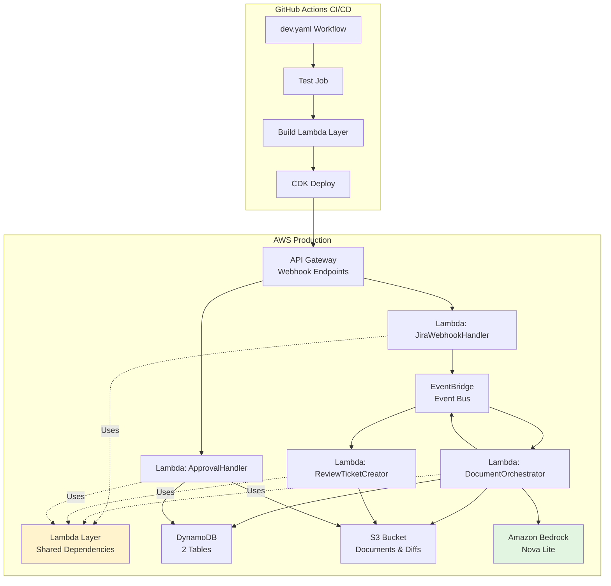

# GitHub Actions AWS Deployment Guide

Complete guide for setting up automated AWS serverless deployment using GitHub Actions for Kinexus AI.

## Overview

The `.github/workflows/dev.yaml` workflow provides automated deployment to AWS with the following features:

- **Automated Testing**: Runs full test suite before deployment (black, isort, ruff, bandit)
- **Multi-Environment Support**: Deploy to development or production environments
- **Serverless Architecture**: Lambda functions, API Gateway, DynamoDB, S3, EventBridge
- **Lambda Layer Build**: Automated dependency packaging for Lambda functions
- **CDK Infrastructure**: Infrastructure-as-code deployment using AWS CDK
- **Health Checks**: Post-deployment validation
- **Security Scanning**: Bandit security analysis before deployment

## Production Architecture

Kinexus AI uses **serverless AWS Lambda architecture only**:



**What Gets Deployed:**
- 4 Lambda functions (JiraWebhookHandler, DocumentOrchestrator, ReviewTicketCreator, ApprovalHandler)
- Lambda layer with shared dependencies (~30MB: structlog, httpx, pydantic, requests, html2text)
- API Gateway with 2 webhook endpoints (/webhooks/jira, /webhooks/approval)
- EventBridge event bus with 2 rules (ChangeDetected → DocumentGenerated)
- 2 DynamoDB tables (kinexus-changes, kinexus-documents)
- 1 S3 bucket (documents, diffs, versioning enabled)
- CloudWatch Logs (1-week retention)

**Cost:** ~$25-90/month (scales with usage)

## Workflow Triggers

### Automatic Deployments

- **Push to `develop`** → Development environment
- **Pull Request to `develop`** → Run tests only (no deployment)

### Manual Deployments

Use the "Run workflow" button in GitHub Actions to deploy manually:

1. Go to Actions → Deploy to AWS
2. Click "Run workflow"
3. Select branch (typically `develop`)
4. Click "Run workflow"

## Prerequisites

### 1. AWS Account Setup

You need an AWS account with:
- Bedrock access (Amazon Nova Lite model enabled - no approval needed)
- Sufficient permissions for CDK deployment
- AWS credentials configured

**Option A: Create IAM User (Simpler for Testing)**
```bash
# Create IAM user for deployment
aws iam create-user --user-name kinexus-ai-deployer

# Create access keys
aws iam create-access-key --user-name kinexus-ai-deployer

# Attach admin permissions (development only - use least privilege for production)
aws iam attach-user-policy \
  --user-name kinexus-ai-deployer \
  --policy-arn arn:aws:iam::aws:policy/AdministratorAccess
```

**Option B: Use OIDC (Recommended for Production)**

For secure, keyless authentication using OIDC:

```bash
# Create OIDC provider in AWS
aws iam create-open-id-connect-provider \
  --url https://token.actions.githubusercontent.com \
  --client-id-list sts.amazonaws.com \
  --thumbprint-list 6938fd4d98bab03faadb97b34396831e3780aea1

# Create IAM role for GitHub Actions
aws iam create-role \
  --role-name GitHubActionsDeploymentRole \
  --assume-role-policy-document file://github-actions-trust-policy.json

# Attach admin permissions
aws iam attach-role-policy \
  --role-name GitHubActionsDeploymentRole \
  --policy-arn arn:aws:iam::aws:policy/AdministratorAccess
```

**github-actions-trust-policy.json**:
```json
{
  "Version": "2012-10-17",
  "Statement": [
    {
      "Effect": "Allow",
      "Principal": {
        "Federated": "arn:aws:iam::YOUR_ACCOUNT_ID:oidc-provider/token.actions.githubusercontent.com"
      },
      "Action": "sts:AssumeRoleWithWebIdentity",
      "Condition": {
        "StringEquals": {
          "token.actions.githubusercontent.com:aud": "sts.amazonaws.com"
        },
        "StringLike": {
          "token.actions.githubusercontent.com:sub": "repo:YOUR_ORG/kinexus-ai:*"
        }
      }
    }
  ]
}
```

### 2. GitHub Secrets Configuration

Configure the following secrets in your GitHub repository:

**Go to: Settings → Secrets and variables → Actions → New repository secret**

#### Required Secrets

| Secret Name | Description | Example Value |
|-------------|-------------|---------------|
| `AWS_ACCOUNT_ID` | Your AWS account ID | `123456789012` |
| `JIRA_BASE_URL` | Your Jira instance URL | `https://yourcompany.atlassian.net` |
| `JIRA_EMAIL` | Jira user email for API access | `user@company.com` |
| `JIRA_API_TOKEN` | Jira API token | `ATATT3xFfGF0...` |
| `CONFLUENCE_URL` | Your Confluence wiki URL | `https://yourcompany.atlassian.net/wiki` |

#### Authentication Secrets (Choose One)

**Option A: Access Keys (Simpler)**
| Secret Name | Description | Example Value |
|-------------|-------------|---------------|
| `AWS_ACCESS_KEY_ID` | AWS access key ID | `AKIA****************` |
| `AWS_SECRET_ACCESS_KEY` | AWS secret access key | `********************************` |

**Option B: OIDC (Recommended)**
| Secret Name | Description | Example Value |
|-------------|-------------|---------------|
| `AWS_ROLE_ARN` | ARN of the IAM role for OIDC | `arn:aws:iam::123456789012:role/GitHubActionsDeploymentRole` |

#### Setting Secrets via CLI

```bash
# Using GitHub CLI
gh secret set AWS_ACCOUNT_ID --body "123456789012"
gh secret set JIRA_BASE_URL --body "https://yourcompany.atlassian.net"
gh secret set JIRA_EMAIL --body "user@company.com"
gh secret set JIRA_API_TOKEN --body "ATATT3xFfGF0..."
gh secret set CONFLUENCE_URL --body "https://yourcompany.atlassian.net/wiki"

# Option A: Access keys
gh secret set AWS_ACCESS_KEY_ID --body "AKIA****************"
gh secret set AWS_SECRET_ACCESS_KEY --body "********************************"

# Option B: OIDC
gh secret set AWS_ROLE_ARN --body "arn:aws:iam::123456789012:role/GitHubActionsDeploymentRole"
```

## Workflow Jobs

The `.github/workflows/dev.yaml` workflow includes the following jobs:

### 1. Test Job

Runs comprehensive test suite before deployment:

**Code Quality:**
- `black --check` - Code formatting validation
- `isort --check-only` - Import statement ordering
- `ruff check` - Fast Python linter

**Security:**
- `bandit` - Security vulnerability scanning

**Testing:**
- `pytest` - Unit and integration tests (when available)

**Environment:** Runs in Docker container (`python:3.11-slim`)

### 2. Build Lambda Layer Job

Builds the Lambda layer with all dependencies:

**What It Does:**
1. Runs `scripts/build-layer.sh`
2. Exports dependencies from `requirements-lambda.txt` via Poetry
3. Installs packages to `lambda_layer/python/` directory
4. Removes unnecessary files (__pycache__, .pyc, tests, docs)
5. Creates `lambda_layer.zip` artifact

**Dependencies Included:**
- structlog (logging)
- httpx (HTTP client)
- anthropic (Bedrock SDK)
- pydantic (data validation)
- requests (HTTP requests for Jira/Confluence APIs)
- html2text (HTML to Markdown conversion)
- orjson (fast JSON parsing)

**Dependencies Excluded:**
- boto3 (provided by AWS Lambda runtime)
- botocore (provided by AWS Lambda runtime)

**Output:** `lambda_layer.zip` (~30MB compressed)

### 3. Deploy Job

Deploys infrastructure using AWS CDK:

**Steps:**
1. **Checkout code**
2. **Configure AWS credentials** (access keys or OIDC)
3. **Download Lambda layer artifact** from build job
4. **Set up Python 3.11**
5. **Install CDK CLI** (`npm install -g aws-cdk`)
6. **Install CDK dependencies** (`pip install -r infrastructure/requirements.txt`)
7. **CDK Bootstrap** (first time only - creates S3 bucket for CDK assets)
8. **CDK Deploy**:
   ```bash
   cdk deploy KinexusAIMVPStack-Development \
     --context environment=development \
     --context jira_base_url=$JIRA_BASE_URL \
     --context jira_email=$JIRA_EMAIL \
     --context jira_api_token=$JIRA_API_TOKEN \
     --context confluence_url=$CONFLUENCE_URL \
     --require-approval never \
     --outputs-file cdk-outputs.json
   ```
9. **Upload outputs** as GitHub Actions artifact

**What Gets Created:**
- CloudFormation stack: `KinexusAIMVPStack-Development`
- 4 Lambda functions with environment variables
- Lambda layer attachment to all functions
- API Gateway REST API with 2 endpoints
- EventBridge event bus `kinexus-events` with 2 rules
- DynamoDB tables: `kinexus-changes`, `kinexus-documents`
- S3 bucket: `kinexus-documents-{account-id}-us-east-1`
- IAM roles and policies for Lambda functions
- CloudWatch Log groups (1-week retention)

**Environment Variables (Set on Lambda Functions):**
- `JIRA_BASE_URL` - Jira instance URL
- `JIRA_EMAIL` - Jira user email
- `JIRA_API_TOKEN` - Jira API token
- `CONFLUENCE_URL` - Confluence wiki URL
- `CHANGES_TABLE` - DynamoDB table name for changes
- `DOCUMENTS_TABLE` - DynamoDB table name for documents
- `DOCUMENTS_BUCKET` - S3 bucket name
- `EVENT_BUS` - EventBridge bus name

## Triggering Deployments

### Automatic Deployment

```bash
# Deploy to development
git checkout develop
git add .
git commit -m "feat: new feature"
git push origin develop

# Workflow automatically triggers and deploys to AWS
```

### Manual Deployment

1. Go to GitHub Actions tab
2. Select "Deploy to AWS" workflow
3. Click "Run workflow"
4. Select branch: `develop`
5. Click "Run workflow"
6. Monitor progress in GitHub Actions UI

## Monitoring Deployments

### GitHub Actions UI

View deployment progress:
1. Go to Actions tab
2. Click on the running workflow
3. Monitor each job's progress
4. View logs for detailed output

### AWS Console

Monitor AWS resources:

**CloudFormation:**
- Stack name: `KinexusAIMVPStack-Development`
- View stack status, events, resources, outputs

**Lambda:**
- Functions: JiraWebhookHandler, DocumentOrchestrator, ReviewTicketCreator, ApprovalHandler
- View metrics, logs, configuration
- Test functions with sample events

**CloudWatch Logs:**
- Log groups: `/aws/lambda/KinexusAIMVPStack-Develop-*`
- 1-week retention
- Real-time log tailing available

**DynamoDB:**
- Tables: `kinexus-changes`, `kinexus-documents`
- View items, scan/query data
- Monitor read/write capacity

**S3:**
- Bucket: `kinexus-documents-{account-id}-us-east-1`
- View documents and diffs
- Versioning enabled for audit trail

**EventBridge:**
- Event bus: `kinexus-events`
- Rules: ChangeDetectedRule, DocumentGeneratedRule
- View event history and metrics

### Deployment Outputs

After successful deployment, outputs are available in `cdk-outputs.json`:

```json
{
  "KinexusAIMVPStack-Development": {
    "WebhookAPIEndpoint": "https://abc123.execute-api.us-east-1.amazonaws.com/prod/",
    "JiraWebhookURL": "https://abc123.execute-api.us-east-1.amazonaws.com/prod/webhooks/jira",
    "ApprovalWebhookURL": "https://abc123.execute-api.us-east-1.amazonaws.com/prod/webhooks/approval",
    "DocumentsBucket": "kinexus-documents-123456789012-us-east-1",
    "EventBusName": "kinexus-events"
  }
}
```

Download the artifact from GitHub Actions to view outputs locally.

## Troubleshooting

### Deployment Failures

**Test Failures:**
```bash
# Check GitHub Actions logs for specific test failures
# Common issues:
# - black formatting not applied
# - isort import order incorrect
# - ruff linting errors
# - bandit security issues

# Solutions:
# Fix locally and test before pushing:
docker run --rm -v "$PWD:/code" -w /code python:3.11-slim bash -c \
  "pip install -q black==25.9.0 isort==5.* ruff==0.1.* bandit && \
   black src/ tests/ && \
   isort src/ tests/ && \
   ruff check src/ tests/ --fix && \
   bandit -r src/"
```

**Lambda Layer Build Failures:**
```bash
# Test build locally
./scripts/build-layer.sh

# Common issues:
# - Poetry not installed
# - requirements-lambda.txt missing packages
# - Disk space issues

# Solutions:
# - Install Poetry: pipx install poetry
# - Verify requirements: poetry export --only lambda
# - Clear space: rm -rf lambda_layer.zip lambda_layer/
```

**CDK Deployment Failures:**
```bash
# View CloudFormation events in AWS Console
# Common issues:
# - Resource limits exceeded (Lambda, DynamoDB)
# - Insufficient permissions
# - Stack already exists (first deployment)
# - Lambda code size too large

# Solutions:
# - Check AWS service quotas
# - Verify IAM permissions include all required actions
# - For first deployment: cdk bootstrap
# - Reduce Lambda layer size (remove unnecessary deps)
```

**CDK Bootstrap Not Run:**
```bash
# If you see "CDK bootstrap required" error:
cdk bootstrap aws://ACCOUNT-ID/us-east-1

# This creates:
# - S3 bucket for CDK assets: cdk-hnb659fds-assets-ACCOUNT-ID-us-east-1
# - ECR repository for Docker images (not used by Kinexus)
# - IAM roles for CloudFormation
```

### Rollback Failed Deployment

**Automatic Rollback:**
CDK automatically rolls back failed deployments. Check CloudFormation events for details.

**Manual Rollback:**
```bash
# Option 1: Redeploy previous commit
git revert HEAD
git push origin develop

# Option 2: Destroy and redeploy
cdk destroy KinexusAIMVPStack-Development
# Then push to trigger new deployment

# Option 3: Update individual Lambda function
aws lambda update-function-code \
  --function-name KinexusAIMVPStack-Develop-DocumentOrchestrator... \
  --zip-file fileb://previous-version.zip
```

### Common Errors

**Error: "No module named 'structlog'" in Lambda**
```bash
# Lambda layer not attached or missing dependencies
# Solution: Rebuild Lambda layer
./scripts/build-layer.sh
git add lambda_layer.zip
git commit -m "fix: rebuild Lambda layer"
git push origin develop
```

**Error: "ValidationException" from Bedrock**
```bash
# Amazon Nova Lite not enabled in region
# Solution: Check Bedrock model access in AWS Console
# Go to Bedrock → Model access → Enable Amazon Nova Lite
```

**Error: "AccessDeniedException" from DynamoDB/S3/EventBridge**
```bash
# Insufficient IAM permissions for Lambda execution role
# Solution: Verify CDK is granting correct permissions
# Check infrastructure/app.py Lambda role policies
```

**Error: "Stack already exists"**
```bash
# Attempting to create stack that already exists
# Solution: Use update instead of create
cdk deploy --force
```

## Security Best Practices

### 1. Use OIDC Instead of Access Keys

✅ **Recommended**: OIDC with IAM roles (no long-lived credentials)
❌ **Avoid**: Access keys in GitHub secrets

OIDC benefits:
- No credential rotation needed
- Automatic credential expiration (1 hour)
- No risk of leaked access keys
- Auditable in CloudTrail

### 2. Least Privilege Permissions

Current deployment uses `AdministratorAccess` for simplicity. For production:

```bash
# Create custom policy with only required permissions
cat > deployment-policy.json <<'EOF'
{
  "Version": "2012-10-17",
  "Statement": [
    {
      "Effect": "Allow",
      "Action": [
        "cloudformation:*",
        "lambda:*",
        "apigateway:*",
        "dynamodb:*",
        "s3:*",
        "events:*",
        "iam:*",
        "logs:*",
        "bedrock:InvokeModel"
      ],
      "Resource": "*"
    }
  ]
}
EOF

aws iam create-policy \
  --policy-name KinexusAI-Deployment-Policy \
  --policy-document file://deployment-policy.json
```

### 3. Secrets Management

- ✅ Use GitHub Secrets for sensitive data
- ✅ Migrate to AWS Secrets Manager for production
- ❌ Never commit secrets to repository
- ✅ Rotate Jira API tokens regularly

### 4. Branch Protection

Recommended branch protection rules for `develop`:

- ✅ Require pull request reviews (1 reviewer)
- ✅ Require status checks to pass (Tests job)
- ✅ Require branches to be up to date
- ✅ Include administrators (enforce for all)

## Cost Optimization

### Lambda Functions

**Current Configuration:**
- 4 functions
- 512MB-1024MB memory
- 30s-5min timeout
- ~100-500 invocations/day (typical)

**Monthly Cost Estimate:**
- Free tier: 1M requests, 400,000 GB-seconds
- Typical usage: ~15,000 requests/month
- **Cost: $0-5/month** (within free tier)

### DynamoDB

**Current Configuration:**
- 2 tables
- On-demand pricing
- ~1,000 reads/day, ~100 writes/day

**Monthly Cost Estimate:**
- Free tier: 25 GB storage, 25 read capacity units, 25 write capacity units
- Typical usage: <1 GB, <1M reads, <100K writes
- **Cost: $0-3/month** (within free tier)

### S3

**Current Configuration:**
- 1 bucket
- Versioning enabled
- ~100 documents, ~50 diffs

**Monthly Cost Estimate:**
- Free tier: 5 GB storage, 20,000 GET requests, 2,000 PUT requests
- Typical usage: <1 GB, <10,000 requests
- **Cost: $0-2/month** (within free tier)

### API Gateway

**Current Configuration:**
- REST API
- 2 webhook endpoints
- ~500 requests/day

**Monthly Cost Estimate:**
- Free tier: 1M requests/month (12 months)
- Typical usage: ~15,000 requests/month
- **Cost: $0** (within free tier)

### Amazon Bedrock (Nova Lite)

**Current Configuration:**
- Amazon Nova Lite model
- ~50 documentation generations/day
- ~500 tokens input, ~2000 tokens output per generation

**Monthly Cost Estimate:**
- Input: ~750K tokens/month × $0.00006/1K = $0.045
- Output: ~3M tokens/month × $0.00024/1K = $0.72
- **Cost: ~$0.80/month**

### EventBridge

**Current Configuration:**
- 1 event bus
- 2 rules
- ~500 events/day

**Monthly Cost Estimate:**
- Free tier: 1M events/month (always free)
- Typical usage: ~15,000 events/month
- **Cost: $0** (within free tier)

### Total Monthly Cost

**Development Environment:**
- Lambda: $0-5
- DynamoDB: $0-3
- S3: $0-2
- API Gateway: $0
- Bedrock: ~$1
- EventBridge: $0
- CloudWatch Logs: $0-2

**Total: ~$5-15/month** (mostly within AWS free tier)

**Production Environment (higher usage):**
- Estimate: $25-90/month
- Scales with number of Jira tickets, documentation generations, and Confluence updates

## Next Steps

### 1. Fork and Clone Repository

```bash
# Fork on GitHub (use fork button)
# Clone your fork
git clone https://github.com/YOUR_USERNAME/kinexus-ai.git
cd kinexus-ai
```

### 2. Configure AWS Credentials

```bash
# Option A: Create IAM user with access keys
aws configure

# Option B: Set up OIDC (recommended)
# Follow OIDC setup instructions above
```

### 3. Configure GitHub Secrets

```bash
# Set all required secrets
gh secret set AWS_ACCOUNT_ID --body "123456789012"
gh secret set JIRA_BASE_URL --body "https://yourcompany.atlassian.net"
gh secret set JIRA_EMAIL --body "user@company.com"
gh secret set JIRA_API_TOKEN --body "YOUR_TOKEN"
gh secret set CONFLUENCE_URL --body "https://yourcompany.atlassian.net/wiki"

# Option A: Access keys
gh secret set AWS_ACCESS_KEY_ID --body "AKIA..."
gh secret set AWS_SECRET_ACCESS_KEY --body "..."

# Option B: OIDC
gh secret set AWS_ROLE_ARN --body "arn:aws:iam::123456789012:role/GitHubActionsDeploymentRole"
```

### 4. Test Workflow Locally (Optional)

```bash
# Run tests locally before pushing
docker run --rm -v "$PWD:/code" -w /code python:3.11-slim bash -c \
  "pip install -q black==25.9.0 isort==5.* ruff==0.1.* bandit && \
   black --check src/ tests/ && \
   isort --check-only src/ tests/ && \
   ruff check src/ tests/ && \
   bandit -r src/"

# Build Lambda layer locally
./scripts/build-layer.sh
```

### 5. Deploy to AWS

```bash
# Create feature branch
git checkout -b feature/my-changes

# Make changes and commit
git add .
git commit -m "feat: my changes"

# Push to trigger deployment
git push origin feature/my-changes

# Merge to develop when ready
git checkout develop
git merge feature/my-changes
git push origin develop
```

### 6. Verify Deployment

```bash
# Check CloudFormation stack
aws cloudformation describe-stacks \
  --stack-name KinexusAIMVPStack-Development \
  --query 'Stacks[0].Outputs'

# Get webhook URLs
aws cloudformation describe-stacks \
  --stack-name KinexusAIMVPStack-Development \
  --query 'Stacks[0].Outputs[?OutputKey==`JiraWebhookURL`].OutputValue' \
  --output text

# Test health endpoint (if available)
curl https://YOUR_API_ID.execute-api.us-east-1.amazonaws.com/prod/health
```

### 7. Configure Jira Webhooks

See [Atlassian Setup Guide](atlassian-setup-guide.md) for complete instructions.

## Support

For issues or questions:

- **GitHub Issues**: [kinexus-ai/issues](https://github.com/jaredgiosinuff/kinexus-ai/issues)
- **Documentation**: [docs/](../docs/)
- **Deployment Guide**: [docs/deployment.md](./deployment.md)
- **Architecture**: [docs/architecture.md](./architecture.md)

---

**Related Documentation:**
- [Deployment Guide](./deployment.md) - General AWS deployment overview
- [Architecture Overview](./architecture.md) - System architecture and components
- [Atlassian Setup Guide](./atlassian-setup-guide.md) - Configure Jira and Confluence webhooks
- [Documentation Workflow](./documentation-workflow.md) - How the system generates and publishes documentation
