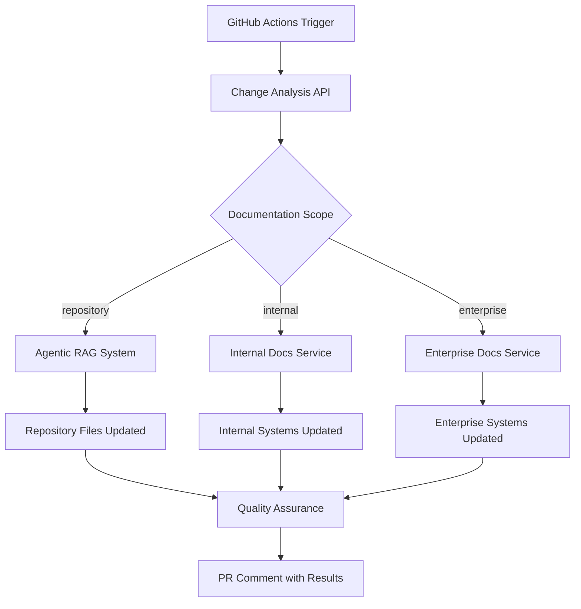

# GitHub Actions Integration

KinexusAI provides comprehensive GitHub Actions integration for automated documentation workflows using tiered documentation approach and intelligent AI agents.

## Overview

The GitHub Actions integration implements **automated documentation synchronization** with different scopes based on branch targeting:

- **Feature/Topic Branches → Repository Only**: Updates documentation within the repository (README, API docs)
- **Development Branch → Internal Systems**: Updates internal wikis, Notion, Confluence internal
- **Main/Master Branch → Enterprise Systems**: Updates customer-facing Confluence, SharePoint, API portals

## Architecture



## Services Integration

The GitHub Actions workflow integrates with deployed Docker services:

### **API Server** (localhost:3105)
- Receives change analysis requests from GitHub Actions
- Coordinates documentation updates across systems
- Provides status and quality metrics

### **Agentic RAG System**
- Analyzes code changes with specialized retrievers
- Generates contextually appropriate documentation updates
- Maintains consistency across documentation formats

### **GraphRAG Service** (localhost:3111)
- Provides relationship-aware retrieval for complex codebases
- Identifies interconnected components that need documentation updates
- Ensures comprehensive coverage of affected systems

### **OpenSearch** (localhost:3103)
- Vector search for finding related documentation
- Semantic similarity matching for content updates
- Historical change pattern analysis

## Implementation Phases

### Phase 1 – Secure Plan Generation ✅

**Completed Features:**
1. **Secure endpoint**: `/api/webhooks/github/actions` accepts GitHub Actions payloads signed with `GITHUB_ACTIONS_WEBHOOK_TOKEN`
2. **Plan-only orchestration**: Workflows call orchestrator in "dry run" mode; no external updates executed automatically
3. **Persistence**: Generated plans stored in `documentation_plans` table and retrievable via `GET /api/documentation-plans`
4. **Telemetry**: Plans capture branch context and execution mode for analytics

### Phase 2 – Review Integration

**Current Implementation:**
- `POST /api/documentation-plans/{plan_id}/link-review` associates plans with reviews
- Plans surface in UI/API alongside review details
- Review API includes plan references

**Available:**
- CLI/API tooling for re-triggering plan generation via `POST /api/documentation-plans/{plan_id}/rerun`

### Phase 3 – Controlled Execution

**Implementation Status:**
- Platform-specific executors for GitHub commits, Confluence API, SharePoint automation
- Feature flags for controlled rollout
- Explicit approval requirements (reviewer action or PR label)
- Idempotent, audited, rollback-capable updates

### Phase 4 – Policy & Monitoring

**Planned Features:**
- Repository-specific `.kinexus/config.yaml` overrides
- Branch/label policies (skip automation for hotfix branches)
- Dashboards/alerts for automation success, failures, and cost

## Setup & Configuration

### 1. GitHub Repository Setup

Add these secrets to your GitHub repository:

```bash
KINEXUS_API_URL=https://api.kinexusai.com  # Or your deployed URL
KINEXUS_API_KEY=your_api_key_here
```

### 2. Workflow Configuration

The workflow file is automatically created at `.github/workflows/documentation-sync.yml`:

```yaml
name: Documentation Sync

on:
  pull_request:
    types: [opened, synchronize, reopened]
    branches: ['main', 'master', 'dev', 'development', 'feature/*']
  push:
    branches: ['main', 'master', 'dev', 'development']

env:
  KINEXUS_API_URL: ${{ secrets.KINEXUS_API_URL }}
  KINEXUS_API_KEY: ${{ secrets.KINEXUS_API_KEY }}
```

### 3. API Endpoints

#### Change Analysis: `/api/v1/analyze-changes`

Analyzes code changes and determines documentation impact:

```json
{
  "repository": "myorg/myrepo",
  "ref": "refs/heads/feature/new-api",
  "sha": "abc123",
  "changed_files": ["src/api/users.py", "src/models/user.py"],
  "scope": "repository",
  "pr_number": 42,
  "branch": "feature/new-api"
}
```

**Response:**
```json
{
  "status": "analyzed",
  "impact_score": 7,
  "affected_documents": ["docs/api/users.md", "docs/models.md"],
  "recommendations": [
    "Update API documentation for new endpoints",
    "Review authentication flow changes"
  ],
  "estimated_effort": "105 minutes"
}
```

#### Documentation Updates: `/api/v1/update-documentation`

Performs actual documentation updates:

```json
{
  "action": "update_repository_docs",
  "repository": "myorg/myrepo",
  "branch": "feature/new-api",
  "changed_files": ["src/api/users.py"],
  "scope": "repository",
  "targets": ["README.md", "API_DOCS.md"]
}
```

**Response:**
```json
{
  "status": "updated",
  "targets_updated": ["README.md", "API_DOCS.md", "CHANGELOG.md"],
  "changes_made": [
    "Updated README with new features",
    "Refreshed API documentation",
    "Added changelog entries"
  ],
  "quality_score": 0.92
}
```

#### Quality Assurance: `/api/v1/quality-check`

Validates documentation quality:

```json
{
  "action": "quality_check",
  "repository": "myorg/myrepo",
  "scope": "enterprise",
  "impact_score": 8
}
```

**Response:**
```json
{
  "status": "checked",
  "quality_score": 0.89,
  "issues_found": [],
  "recommendations": [
    "Documentation is well-structured",
    "All required sections are present"
  ],
  "compliance_status": "compliant"
}
```

## Documentation Scopes

### Repository Scope
**Triggers**: PRs to feature branches, topic branches

**Updates**:
- README.md
- API documentation files
- Inline code comments
- CHANGELOG.md

**Services Used**:
- Agentic RAG for intelligent content generation
- Local file system updates via git commits

### Internal Scope
**Triggers**: PRs to `dev`, `development` branches

**Updates**:
- Internal team wikis
- Notion workspaces
- Internal Confluence spaces
- Architecture documentation

**Services Used**:
- Enterprise connectors for internal systems
- GraphRAG for relationship awareness
- Change impact analysis

### Enterprise Scope
**Triggers**: PRs to `main`, `master` branches

**Updates**:
- Customer-facing Confluence
- SharePoint documentation sites
- API portals and developer docs
- Compliance documentation

**Services Used**:
- Full enterprise connector suite
- Compliance validation agents
- Multi-modal content generation (Nova Canvas)
- Quality assurance workflows

## Workflow Examples

### Example 1: Feature Branch Documentation Update

1. **Developer creates PR** to `feature/user-auth` branch
2. **GitHub Actions triggers** documentation-sync workflow
3. **Change Analysis** determines "repository" scope, impact score 5/10
4. **Agentic RAG** analyzes authentication changes
5. **Repository Updates** modifies README.md and API docs
6. **Quality Check** validates updates meet standards
7. **Git Commit** pushes documentation updates to branch
8. **PR Comment** shows summary of changes made

### Example 2: Production Deployment Documentation

1. **PR merged** to `main` branch with infrastructure changes
2. **GitHub Actions triggers** with "enterprise" scope
3. **GraphRAG Analysis** identifies related systems and docs
4. **Enterprise Updates** pushes to Confluence, SharePoint, API portal
5. **Compliance Check** ensures security/legal requirements met
6. **Quality Assurance** validates enterprise documentation standards
7. **Monitoring Alert** confirms successful publication
8. **Audit Log** records all changes for compliance

## Monitoring & Quality Assurance

### Built-in Quality Checks

- **Accuracy**: AI-generated content matches code changes
- **Consistency**: Documentation style matches existing content
- **Completeness**: All affected areas are updated
- **Compliance**: Enterprise updates meet security/legal requirements

### Metrics & Monitoring

Track automation through:

- **Prometheus metrics** exposed at `/metrics`
- **Change impact scores** in PR comments
- **Update success rates** by scope and target system
- **Quality scores** for generated documentation
- **Cost tracking** for AI model usage
- **Performance metrics** for workflow execution time

### Dashboard Views

- **System Overview**: Overall automation health and statistics
- **Agent Performance**: Individual AI agent effectiveness and confidence
- **Documentation Coverage**: Which systems have automated updates
- **Quality Trends**: Documentation quality over time
- **Cost Analysis**: AI usage costs and optimization opportunities

## Troubleshooting

### Common Issues

#### Workflow Authentication Errors
```bash
# Check secrets are set
echo $KINEXUS_API_URL
echo $KINEXUS_API_KEY

# Verify API endpoint
curl -H "Authorization: Bearer $KINEXUS_API_KEY" $KINEXUS_API_URL/health
```

#### Failed Documentation Updates
```bash
# Check API logs
curl $KINEXUS_API_URL/api/documentation-plans

# Review specific plan
curl $KINEXUS_API_URL/api/documentation-plans/{plan_id}

# Re-trigger plan execution
curl -X POST $KINEXUS_API_URL/api/documentation-plans/{plan_id}/rerun
```

#### Quality Check Failures
- Review AI confidence scores in plan details
- Check enterprise compliance requirements
- Verify target system permissions and connectivity
- Review change impact analysis for accuracy

## Advanced Configuration

### Repository-Specific Configuration

Create `.kinexus/config.yaml` in your repository:

```yaml
documentation:
  enabled: true
  scopes:
    repository:
      targets: ["README.md", "docs/api/", "CHANGELOG.md"]
      auto_commit: true
    internal:
      targets: ["notion", "internal_wiki"]
      require_approval: false
    enterprise:
      targets: ["confluence", "sharepoint", "api_portal"]
      require_approval: true
      compliance_check: true

automation:
  skip_branches: ["hotfix/*", "release/*"]
  require_labels: ["documentation"]
  ai_confidence_threshold: 0.8

quality:
  enable_compliance_check: true
  require_security_review: true
  max_impact_score: 10
```

### Branch Policies

Customize behavior based on branch patterns:

```yaml
branch_policies:
  "feature/*":
    scope: repository
    auto_execute: true
  "dev":
    scope: internal
    require_approval: false
  "main":
    scope: enterprise
    require_approval: true
    compliance_check: true
```

## Benefits

1. **Automatic Synchronization**: Documentation stays current with code changes
2. **Tiered Approach**: Right level of updates for each environment
3. **Quality Assurance**: AI-powered validation and review
4. **Enterprise Integration**: Seamless updates across all documentation systems
5. **Developer Experience**: Zero-friction documentation maintenance
6. **Audit Trail**: Complete tracking of all documentation changes
7. **Cost Efficiency**: Intelligent routing reduces unnecessary AI processing
8. **Compliance Ready**: Built-in enterprise security and governance

This integration transforms documentation from a manual burden into an automated, intelligent system that enhances rather than hinders the development workflow.