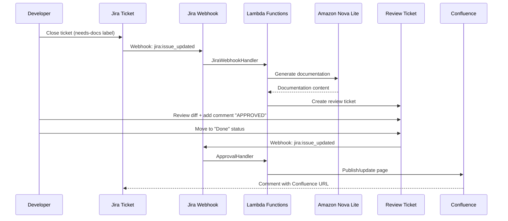

# Production Integrations

> **AWS Lambda Production Environment**
>
> This guide documents **production integrations** for the AWS serverless deployment. The production system uses webhook-based integrations with Jira and Confluence only.
>
> **Local Development Environment**: For the full REST API with Monday.com, GitHub, SharePoint, and ServiceNow integrations, see [Local Development Integrations](local-dev-stack/integrations.md).

## Overview

Kinexus AI's production AWS deployment integrates with Atlassian products (Jira and Confluence) via webhooks. The system automatically:

1. **Detects documentation-worthy changes** from Jira ticket transitions
2. **Generates documentation** using Amazon Nova Lite (AWS Bedrock)
3. **Creates review tickets** in Jira with visual diffs
4. **Publishes approved documentation** to Confluence

## 🔌 Supported Integrations

| Integration | Method | Purpose | Documentation |
|-------------|--------|---------|---------------|
| **Jira** | Webhook | Change detection, review tickets, approval workflow | [Jira Setup](#jira-integration) |
| **Confluence** | REST API | Documentation search, page creation/updates | [Confluence Setup](#confluence-integration) |

**Not Available in Production:**
- Monday.com, GitHub, SharePoint, ServiceNow (local dev only)
- REST API endpoints like `/api/integrations` (local dev only)
- Admin dashboard at `http://localhost:3107` (local dev only)

---

## Jira Integration

### Overview

Jira integration in production uses **two webhooks** to trigger the documentation workflow:

1. **Jira Webhook #1**: Detects when tickets are closed with `needs-docs` label
   - Event: `jira:issue_updated` (status transitions)
   - Endpoint: `POST /webhooks/jira`
   - Handler: `JiraWebhookHandler` Lambda

2. **Jira Webhook #2**: Processes approval decisions on review tickets
   - Event: `jira:issue_updated` (review ticket moved to "Done")
   - Endpoint: `POST /webhooks/approval`
   - Handler: `ApprovalHandler` Lambda

### Setup Steps

**Prerequisites:**
- Jira Cloud instance
- Admin access to configure webhooks
- API token for Kinexus AI

**1. Create API Token**

Follow the [Atlassian Setup Guide](atlassian-setup-guide.md) to:
- Create an Atlassian account (free for up to 10 users)
- Set up Jira Cloud
- Generate API token with appropriate scopes

**2. Configure Jira Webhooks**

After deploying Kinexus AI to AWS, configure two webhooks in Jira:

```bash
# Get webhook URLs from CloudFormation
aws cloudformation describe-stacks \
  --stack-name KinexusAIMVPStack-Development \
  --query 'Stacks[0].Outputs[?contains(OutputKey, `Webhook`)].{Key:OutputKey, URL:OutputValue}' \
  --output table
```

**Webhook #1: Change Detection**
- **URL**: `https://{api-id}.execute-api.{region}.amazonaws.com/prod/webhooks/jira`
- **Events**: `jira:issue_updated`
- **JQL Filter** (optional): `labels = needs-docs OR labels = new-feature OR labels = breaking-change`

**Webhook #2: Approval Processing**
- **URL**: `https://{api-id}.execute-api.{region}.amazonaws.com/prod/webhooks/approval`
- **Events**: `jira:issue_updated`
- **JQL Filter** (optional): `labels = documentation-review AND status = Done`

**3. Verify Webhook Configuration**

Close a Jira ticket with the `needs-docs` label and verify:
- Change record created in DynamoDB `kinexus-changes` table
- DocumentOrchestrator Lambda execution logs in CloudWatch
- Review ticket auto-created in Jira

### Workflow



---

## Confluence Integration

### Overview

Confluence integration enables:
- **Page Search**: CQL-based search to find related pages
- **Page Creation**: Create new documentation pages
- **Page Updates**: Update existing pages in-place
- **Version Tracking**: Automatic version increments with update notes

### Setup Steps

**Prerequisites:**
- Confluence Cloud instance
- Admin access to create spaces
- API token for Kinexus AI (same token as Jira)

**1. Create Confluence Space**

Follow the [Atlassian Setup Guide](atlassian-setup-guide.md) to:
- Set up Confluence Cloud
- Create a space for documentation (e.g., "Software Development" or "SD")
- Note the space key for configuration

**2. Configure Kinexus AI**

During CDK deployment, provide Confluence credentials:

```bash
# GitHub Actions secrets (for CI/CD deployment)
CONFLUENCE_URL=https://yourcompany.atlassian.net/wiki
JIRA_BASE_URL=https://yourcompany.atlassian.net
JIRA_EMAIL=user@company.com
JIRA_API_TOKEN=your_api_token_here
```

**3. Verify Confluence Access**

The ApprovalHandler Lambda will:
- Search for existing pages using CQL queries
- Create new pages in the configured space
- Update existing pages with incremented versions

### Features

**Search & Discovery:**
- Keyword-based CQL search (`title ~ "keyword"`)
- AI-powered relevance ranking
- Decision logic: UPDATE existing vs CREATE new

**Page Management:**
- Automatic version tracking
- Update notes in page history
- HTML storage format (converted from Markdown)

**Smart Updates:**
- Fetches existing content before updating
- Makes minimal targeted modifications
- Preserves existing structure and content

---

## Configuration

### Environment Variables

Lambda functions receive Jira/Confluence credentials as environment variables:

```python
JIRA_BASE_URL=https://yourcompany.atlassian.net
JIRA_EMAIL=user@company.com
JIRA_API_TOKEN=your_token_here
CONFLUENCE_URL=https://yourcompany.atlassian.net/wiki
CONFLUENCE_SPACE_KEY=SD
```

These are configured via CDK context during deployment.

### AWS Resources

The integration uses:
- **API Gateway**: 2 webhook endpoints
- **Lambda Functions**: 4 handlers
- **DynamoDB**: 2 tables (changes, documents)
- **S3 Bucket**: Document storage
- **EventBridge**: Event orchestration

See [Architecture](architecture.md) for detailed component diagrams.

---

## Monitoring

### CloudWatch Logs

Monitor webhook invocations and errors:

```bash
# JiraWebhookHandler logs
aws logs tail /aws/lambda/KinexusAIMVPStack-Develop-JiraWebhookHandlerDE6697-* \
  --since 10m --profile kindexus-ai-dev --region us-east-1

# ApprovalHandler logs
aws logs tail /aws/lambda/KinexusAIMVPStack-Developm-ApprovalHandler2AB7427F-* \
  --since 10m --profile kindexus-ai-dev --region us-east-1
```

### DynamoDB Tables

Check change records and documents:

```bash
# Recent changes
aws dynamodb scan --table-name kinexus-changes \
  --max-items 10 --profile kindexus-ai-dev --region us-east-1

# Recent documents
aws dynamodb scan --table-name kinexus-documents \
  --max-items 10 --profile kindexus-ai-dev --region us-east-1
```

### Jira Review Tickets

Search for auto-generated review tickets:

```
# JQL query
project = YOUR-PROJECT AND labels = documentation-review AND labels = kinexus-ai
ORDER BY created DESC
```

---

## Troubleshooting

### Common Issues

**Webhook Not Triggering:**
- Verify webhook URLs are correct (check CloudFormation outputs)
- Check Jira webhook configuration (Events, JQL filter)
- Review JiraWebhookHandler CloudWatch logs

**Documentation Not Generated:**
- Check DocumentOrchestrator Lambda logs for errors
- Verify Amazon Nova Lite access (Bedrock permissions)
- Check DynamoDB `kinexus-changes` table for change records

**Approval Not Publishing:**
- Verify review ticket has `documentation-review` label
- Confirm review ticket moved to "Done" status
- Check ApprovalHandler Lambda logs for errors
- Verify Confluence credentials and space key

**Confluence Page Already Exists:**
- System should search and UPDATE existing pages
- Check ApprovalHandler logs for search results
- Verify CQL search is finding the correct page

### Debug Commands

```bash
# Check recent GitHub Actions deployments
gh run list --workflow=dev.yaml --branch develop --limit 5

# Get CloudFormation stack outputs
aws cloudformation describe-stacks \
  --stack-name KinexusAIMVPStack-Development \
  --query 'Stacks[0].Outputs' --output json

# Test Jira API access
curl -u "user@company.com:$JIRA_API_TOKEN" \
  "https://yourcompany.atlassian.net/rest/api/3/myself"

# Test Confluence API access
curl -u "user@company.com:$JIRA_API_TOKEN" \
  "https://yourcompany.atlassian.net/wiki/rest/api/content?spaceKey=SD&limit=1"
```

---

## See Also

- **[Atlassian Setup Guide](atlassian-setup-guide.md)** - Step-by-step Jira/Confluence account setup
- **[Architecture](architecture.md)** - AWS Lambda serverless architecture details
- **[API Reference](api-reference.md)** - Webhook endpoint specifications
- **[Documentation Workflow](documentation-workflow.md)** - Complete Phase 1-7 workflow
- **[Deployment Guide](deployment.md)** - AWS CDK deployment instructions
- **[Local Development Integrations](local-dev-stack/integrations.md)** - Full REST API with multiple integrations
